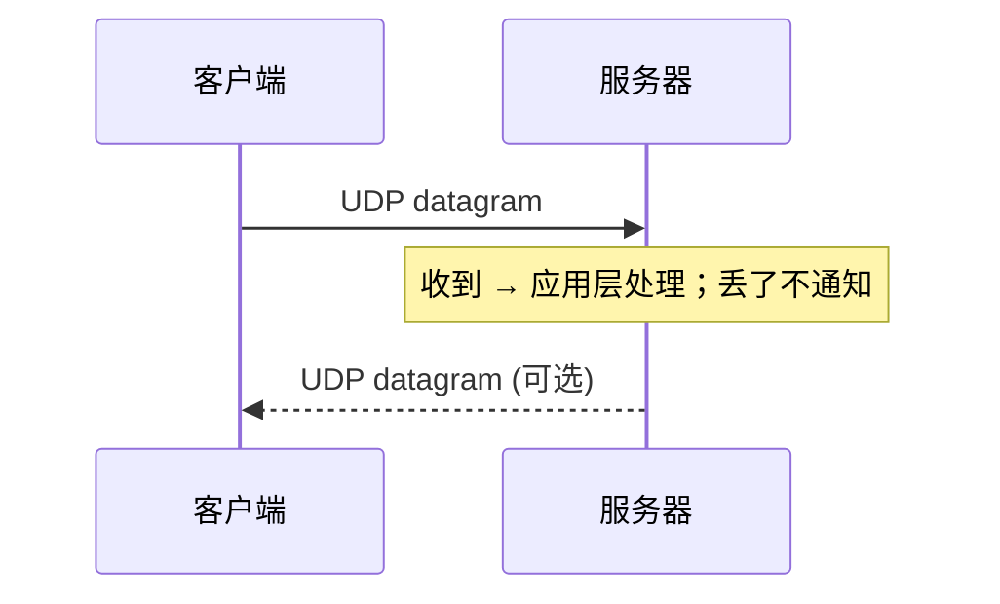

<KeyIdea>
**一句话**：**UDP** 不建连接、不保证可达、不保证顺序，但**只有 8 字节头部**，发完就走。需要实时性的场景（DNS / 视频 / 语音 / 游戏 / QUIC）几乎都选它。
</KeyIdea>

## 是什么

UDP 报文格式：

```
+---------------+---------------+
|   源端口 16   |  目的端口 16  |
+---------------+---------------+
|    长度 16    |  校验和 16    |
+---------------+---------------+
|             数据              |
+-------------------------------+
```

8 字节头 + 数据，**没有序号、没有 ACK、没有重传**。

## 打个比方

<Analogy>
**UDP** 像**对讲机喊话**：按下说话键就喊，听到算你赚到，没听到也不会重喊。**实时**比**完整**重要。
</Analogy>

## 关键概念

<Terms items={[
  { term: "无连接", en: "Connectionless", def: "发送前不握手；任何主机都能直接发包。" },
  { term: "Datagram", en: "数据报", def: "UDP 数据有边界 —— 一次 send 对应一次 recv。" },
  { term: "无可靠性", en: "Unreliable", def: "丢了不会重传；上层应用要自己处理。" },
  { term: "不保证顺序", en: "Out-of-order", def: "包到达顺序可能乱；上层应用要自己排。" },
  { term: "广播 / 组播", en: "Broadcast / Multicast", def: "UDP 天生支持，TCP 不支持（点到点）。" },
]} />

## 怎么工作



操作系统接到 UDP 包就直接转给监听端口的进程，**没有连接概念，没有状态**。

## 实操要点

- **典型协议**：DNS（简单查询）、DHCP、SNMP、NTP、VoIP（RTP）、QUIC（HTTP/3 底层）。
- **UDP 不支持「半双工」/ 「顺序」/ 「可靠」**：要这些就在应用层自建（QUIC 就是这么干的）。
- **NAT 友好度低**：路由器维护 UDP 表项靠超时（TCP 看 SYN/FIN）；超时时间各家不一，常做 P2P 的痛点。
- **MTU 敏感**：UDP 大包易分片；推荐 payload 控制在 MTU 之内（IPv4 通常 1472，IPv6 1452）。
- **抓包**：`tcpdump 'udp port 53'` 看 DNS。

## 易混点

<Compare
  leftTitle="UDP"
  rightTitle="QUIC"
  left={<>
    极简的传输协议本身。<br />
    由应用决定可靠性。
  </>}
  right={<>
    在 UDP 之上自己实现可靠 / 加密 / 多流。<br />
    HTTP/3 用它替代 TCP。
  </>}
/>

## 延伸阅读

- [TCP](/network/beginner/tcp)
- [TCP vs UDP 对照](/network/beginner/tcp-vs-udp)
- [HTTP/3 与 QUIC](/network/advanced/http3-quic)
- [DNS](/network/beginner/dns)
