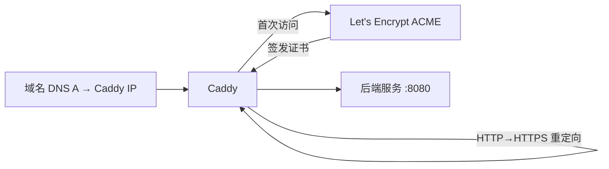

<KeyIdea>
**一句话**：Caddy 是 Go 写的 web 服务器，**默认开启 HTTPS** —— 自动从 Let's Encrypt 申请、自动续期、自动 HTTP→HTTPS 跳转。配置极简，**Caddyfile 5 行能上线一个反代**。
</KeyIdea>

## 是什么

```caddyfile
# 整个 Caddyfile 就这么短：
api.example.com {
    reverse_proxy localhost:8080
}

static.example.com {
    root * /var/www/site
    file_server
    encode gzip zstd
}
```

启动 `caddy run` 就有 HTTPS、HTTP/2、HTTP/3、自动证书 —— **零证书配置**。

## 打个比方

<Analogy>
nginx 像**专业相机**：旋钮一堆，能拍出大片，但门槛高。  
Caddy 像**手机相机**：按下快门就好，自动对焦 / 测光 / HDR —— 90% 场景拍得比相机还省心。
</Analogy>

## 关键概念

<Terms items={[
  { term: "Caddyfile", en: "配置语法", def: "极简 DSL，按域名分块写。也支持 JSON 配置（更精细）。" },
  { term: "Auto HTTPS", en: "自动 HTTPS", def: "支持 ACME（Let's Encrypt / ZeroSSL）。本地局域网域名也能用 internal CA。" },
  { term: "On-demand TLS", en: "按需签发", def: "用户来访问时再申请证书，适合多租户海量域名。" },
  { term: "Modules", en: "模块化", def: "用 xcaddy 编译时按需引入插件（DNS provider、storage backend 等）。" },
  { term: "Admin API", en: "动态配置", def: "本地 :2019 接口，可热更新配置无需 reload。" },
]} />

## 怎么工作



整个证书生命周期对你**完全透明**。

## 实操要点

- **要求 80 / 443 公开可达**：ACME HTTP-01 / TLS-ALPN 挑战需要这两个端口。或用 DNS 挑战（DNS-01）走 Cloudflare 等 API 自动签。
- **HTTP/3 默认开**：浏览器 + 客户端只要支持都会用上。
- **本地开发**：`caddy run` 也能给 `localhost` 发 internal CA 证书，浏览器装根证书后无警告。
- **反代写后端 IPv6**：`reverse_proxy [::1]:8080`，括号别忘。
- **结合 Tailscale / 内网域**：`*.ts.example.com` + DNS-01 + Tailscale 内网 IP，几行配置实现「外网不可达，但内部走 HTTPS」。
- **生产 + 多实例**：用同一份 storage（Redis / S3）共享证书，避免重复签发触发 LE 限流。

## 易混点

<Compare
  leftTitle="Caddy"
  rightTitle="Traefik"
  left={<>
    单进程 + Caddyfile。<br />
    适合手动 / 小规模 / 简洁部署。
  </>}
  right={<>
    动态发现服务（Docker / K8s）。<br />
    适合容器编排环境。
  </>}
/>

## 延伸阅读

- [nginx](/network/ecosystem/nginx)
- [Traefik](/network/ecosystem/traefik)
- [HTTPS](/network/beginner/https) / [TLS](/network/beginner/tls)
