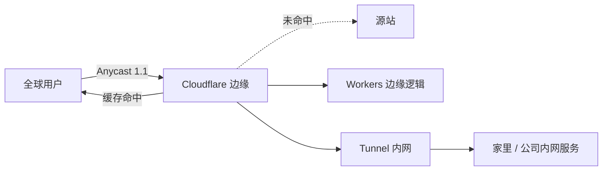

<KeyIdea>
**一句话**：Cloudflare 把 **DNS / CDN / WAF / DDoS 防御 / 边缘计算 / 隧道穿透** 打包提供，全部基于全球 Anycast 网络。免费档对个人站点几乎够用，是中小项目最值的边缘组合。
</KeyIdea>

## 是什么

```
你的域名 NS 指 Cloudflare
       ↓
Cloudflare 帮你做：
  - 权威 DNS（高可用、低延迟）
  - HTTPS 边缘（自动 TLS、HTTP/3）
  - CDN 缓存
  - WAF / Bot 防护 / DDoS
  - Workers（边缘 JS / WASM）
  - Tunnel（暴露内网而不开端口）
  - R2（S3 兼容对象存储）
```

全球 300+ PoP，IP 永远是离用户最近的那个。

## 打个比方

<Analogy>
Cloudflare 像**网站的全球门店总管**：不仅在每个城市开了店（CDN）、雇了保安（DDoS / WAF）、还能在每家店里**就地加工商品**（Workers），甚至给你**临时通道**把仓库（内网）搬到外面卖（Tunnel）。
</Analogy>

## 关键概念

<Terms items={[
  { term: "Proxied", en: "橙色云", def: "DNS 记录是否走 Cloudflare 代理（橙色） vs 直连源（灰色）。" },
  { term: "Page Rules / Rulesets", en: "页面规则", def: "按 URL 匹配开关功能（缓存策略、重定向、Header 改写等）。" },
  { term: "Workers", en: "边缘 JS", def: "在每个 PoP 跑你的 JS / WASM，毫秒级冷启动。" },
  { term: "Tunnel", en: "cloudflared", def: "在内网起 daemon 主动连出 Cloudflare → 不开端口也能暴露内网服务。" },
  { term: "Zero Trust", en: "零信任", def: "Cloudflare Access：替代 VPN，按身份 + 设备验证访问内部应用。" },
  { term: "R2", en: "对象存储", def: "S3 兼容，无 egress 费 —— 静态资源 / CDN 源站友好。" },
]} />

## 怎么工作



DNS 上把记录设成「proxied」就接管了流量。

## 实操要点

- **Cache Everything 模式**：默认 Cloudflare 只缓存静态扩展名。要让 HTML 也缓存就配 Page Rules。
- **TLS 模式选 Full (strict)**：源站必须有合法证书。`Flexible` 是明文回源，**不要用**。
- **Tunnel 是杀手锏**：家庭 / 内网 / NAS 不用买公网 IP、不用做端口转发，**主动 outbound 连 Cloudflare**就能对外暴露。
- **WAF / Rate Limiting**：免费档也能配几条防爬虫规则。可结合 Bot Fight Mode。
- **Workers 不是 Cloudflare 专属语法**：标准 fetch / Response API；本地用 wrangler 调试，部署一行命令。
- **不要把它当唯一防线**：源站 IP 一旦泄露（如错误的 `X-Real-IP` 配置），DDoS 直接打源站 —— 配源站防火墙白名单 Cloudflare IP 段。

## 易混点

<Compare
  leftTitle="Cloudflare CDN"
  rightTitle="自建 nginx 缓存"
  left={<>
    全球 Anycast，免费抗 DDoS。<br />
    配置简单，**用户群越大越值**。
  </>}
  right={<>
    单点 / 自购机房。<br />
    完全自控，**抗压全靠自己**。
  </>}
/>

## 延伸阅读

- [CDN](/network/advanced/cdn)
- [Anycast 与 BGP](/network/advanced/anycast-bgp)
- [WireGuard / Tailscale](/network/ecosystem/wireguard-tailscale)
