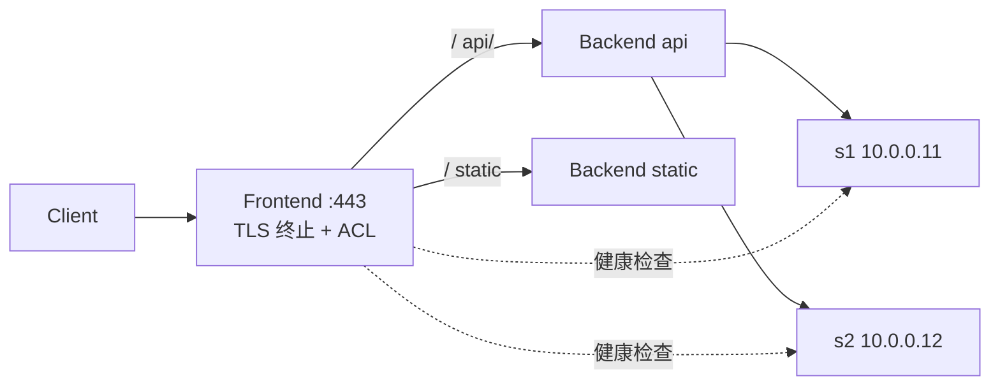

<KeyIdea>
**一句话**：HAProxy 是 C 写的高性能负载均衡器，**单实例可扛百万连接**，同时支持 L4（TCP）和 L7（HTTP），健康检查、ACL、TLS 终止、stick table 这些做得比 nginx 更专业。
</KeyIdea>

## 是什么

```haproxy
frontend www
    bind *:443 ssl crt /etc/ssl/site.pem alpn h2,http/1.1
    default_backend app

backend app
    balance leastconn
    option httpchk GET /healthz
    server s1 10.0.0.11:8080 check
    server s2 10.0.0.12:8080 check
```

frontend 收流量、backend 转后端 —— 概念非常清晰。

## 打个比方

<Analogy>
HAProxy 像**机场调度塔**：实时看每条跑道的状态、流量、延迟，**毫秒级**决定下一架飞机走哪条跑道。专业、严谨、不出花活。
</Analogy>

## 关键概念

<Terms items={[
  { term: "Frontend / Backend", en: "前端/后端", def: "frontend 接客、backend 转发。一个 frontend 可挂多个 backend。" },
  { term: "Balance 算法", en: "负载算法", def: "roundrobin / leastconn / source / uri / hdr 等。" },
  { term: "ACL", en: "条件规则", def: "按 path / 头 / 方法做路由：use_backend api if { path_beg /api }。" },
  { term: "Stick Table", en: "黏性表", def: "做粘性会话 / 限流 / 防护，性能极高。" },
  { term: "Health Check", en: "健康检查", def: "可做 HTTP 检查（option httpchk）或 TCP 探测。" },
  { term: "Runtime API", en: "运行时 API", def: "Unix socket 接口动态摘节点 / 改权重，无需 reload。" },
]} />

## 怎么工作



一个进程多线程模型，各 worker 独立处理连接。

## 实操要点

- **`haproxy -c -f config`**：先校验再 reload。`reload` 用 socket 平滑生效，不掉连接。
- **TLS 终止性能**：硬件辅助 + ECDSA 证书可让单台扛十万 TPS 握手。
- **慢启动 / 主备 / 全量切换**：用 `slowstart`、`backup` 关键字，做灰度 / 熔断很方便。
- **Stats 页面**：`stats uri /haproxy?stats` —— 必须加密码，别裸暴露。
- **TCP 模式**：很适合反代 MySQL / Redis / Kafka 等非 HTTP 协议。
- **HTTP/3 / QUIC**：2.9+ 起内建，配 `bind quic4@:443`。

## 易混点

<Compare
  leftTitle="HAProxy"
  rightTitle="nginx"
  left={<>
    专精 LB / 高级健康检查 / ACL。<br />
    L4 / L7 都强，stick table 很猛。
  </>}
  right={<>
    Web 服务器 + 反代。<br />
    自身处理静态资源更顺手。
  </>}
/>

## 延伸阅读

- [nginx](/network/ecosystem/nginx)
- [负载均衡（L4 vs L7）](/network/advanced/load-balancing)
- [TCP 三次握手](/network/advanced/tcp-handshake)
