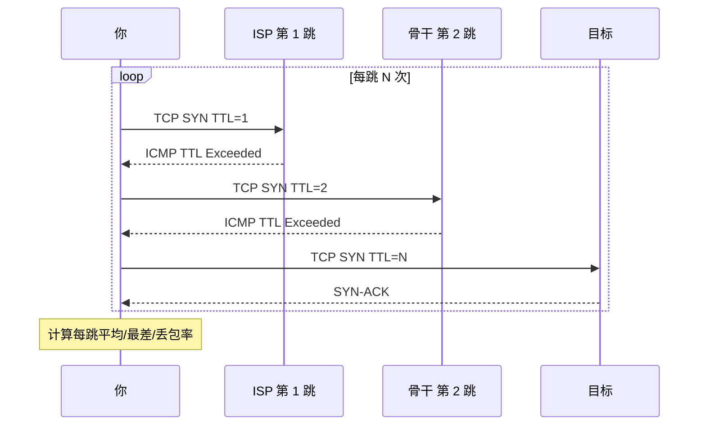

<KeyIdea>
**一句话**：传统 traceroute 靠 ICMP 容易被中间设备屏蔽。**mtr 持续多次探测**得稳定丢包率；**tcptraceroute / `mtr -T`** 改走 TCP 端口，能穿透更多防火墙。
</KeyIdea>

## 是什么

- **mtr**（My Traceroute）= ping + traceroute 持续刷新版；
- **tcptraceroute**：用 TCP SYN 而不是 ICMP / UDP 探测路径；
- 两者结合 = 能稳定看出「**长时间观测下**哪一跳丢包 / 抖动」。

```bash
mtr -wbz -i 1 -c 100 example.com
mtr -T -P 443 example.com
tcptraceroute example.com 443
```

## 打个比方

<Analogy>
单次 ping 像**瞄一眼路况**，可能这一刻正好绿灯；mtr 像**装了一整天的交通摄像头**，看出哪个路段**一直堵**。
</Analogy>

## 关键概念

<Terms items={[
  { term: "ICMP TTL Exceeded", en: "TTL 报错", def: "传统 traceroute 依赖中间路由器返回这个 ICMP；很多 ISP 限速或屏蔽。" },
  { term: "TCP traceroute", en: "TCP 探路", def: "改发 TCP SYN 到目标端口；中间路由器仍回 ICMP，目标会回 SYN-ACK / RST。" },
  { term: "持续探测", en: "Continuous Probe", def: "mtr 不停发，得每跳的丢包率 / 平均 / 最差延迟。" },
  { term: "不对称路由", en: "Asymmetric Path", def: "去和回路径不同 —— traceroute 只看去程，回程问题需对端 mtr。" },
  { term: "JSON / Report 模式", en: "结构化输出", def: "`mtr --json` / `--report` 适合批量自动化采集。" },
]} />

## 怎么工作



mtr 里 `Loss%` 列才是最该看的 —— 单次出问题不算事。

## 实操要点

- **`mtr -T -P 443 host`**：对 HTTPS 服务最实用，不被 ICMP 限速误导。
- **看丢包要看「**最后一跳**」**：中间跳丢包是路由器优先级低（ICMP 限速）造成的，**不一定真丢**；最后一跳还在丢才说明真不通。
- **跨国诊断**：从不同 PoP 跑 mtr 看哪一段最差，常用工具有 [BestTrace](https://www.ipip.net/product/client.html) / 公开 looking-glass。
- **结合源端口**：`mtr -P 443 --tcp -p 12345` 固定源端口，便于路上等价路径不会变（避免诊断时每跳都跳到不同 ECMP 路径）。
- **输出 JSON 接告警**：`mtr -j --report-cycles 30` 用脚本判定某跳丢包率连续 N 次 > 5% 就告警。

## 易混点

<Compare
  leftTitle="mtr / traceroute"
  rightTitle="ping"
  left={<>
    每跳延迟 + 丢包，**定位段**。<br />
    多次累计统计可信。
  </>}
  right={<>
    端到端延迟 + 丢包，**定位有无**。<br />
    单点视角。
  </>}
/>

## 延伸阅读

- [ping](/network/beginner/ping) / [traceroute](/network/beginner/traceroute)
- [TCP 拥塞控制](/network/advanced/congestion-control)
- [Wireshark](/network/ecosystem/wireshark)
