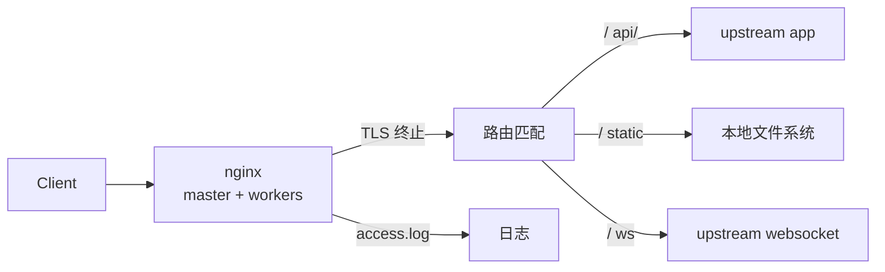

<KeyIdea>
**一句话**：nginx 是 C 写的事件驱动 web 服务器，扮演**反向代理 / 静态服务器 / 负载均衡 / TLS 终止**等多种角色，在生产环境部署量最大。配置文件是它的 API。
</KeyIdea>

## 是什么

最常见的两种用法：

```nginx
# 反向代理一个后端服务
server {
  listen 443 ssl http2;
  server_name api.example.com;
  ssl_certificate     /etc/letsencrypt/live/api/fullchain.pem;
  ssl_certificate_key /etc/letsencrypt/live/api/privkey.pem;

  location / {
    proxy_pass http://127.0.0.1:8080;
    proxy_set_header Host $host;
    proxy_set_header X-Forwarded-For $proxy_add_x_forwarded_for;
    proxy_set_header X-Forwarded-Proto $scheme;
  }
}

# 多后端负载均衡
upstream app {
  server 10.0.0.11:8080 weight=1;
  server 10.0.0.12:8080 weight=2;
  keepalive 64;
}
```

## 打个比方

<Analogy>
nginx 像**酒店前台 + 总机**：客人进门先到他这里，他**接待**（TLS 终止）、**指路**（路由 / 路径匹配）、**叫号**（负载均衡）、**记录**（access log）。后台真正干活的是**客房服务员**（你的应用）。
</Analogy>

## 关键概念

<Terms items={[
  { term: "Worker Processes", en: "工作进程", def: "事件驱动 + 多 worker。auto 通常等于 CPU 核数。" },
  { term: "Location Match", en: "路径匹配", def: "= 精确 / ^~ 前缀（不再正则）/ ~ 正则 / 默认前缀。优先级有讲究。" },
  { term: "Upstream", en: "上游", def: "后端服务组。可以加 keepalive、weight、最少连接、ip_hash。" },
  { term: "Map / If", en: "条件", def: "map 是定义阶段映射、if 在 server/location 内做条件判断（**慎用 if**）。" },
  { term: "Try Files", en: "fallback", def: "`try_files $uri $uri/ /index.html` —— SPA 必备。" },
  { term: "Limit Req", en: "限流", def: "基于 leaky bucket 的速率限制：`limit_req_zone $binary_remote_addr zone=...`。" },
]} />

## 怎么工作



事件驱动模型让 nginx 单进程能扛 10 万 +长连接。

## 实操要点

- **`nginx -t`**：每次改完先 test，再 `nginx -s reload`。**不要直接 restart**。
- **统一 `proxy_set_header`**：尤其 `Host` / `X-Forwarded-For` / `X-Forwarded-Proto`，后端要识别真实客户端。
- **WebSocket 反代**：必须 `proxy_http_version 1.1` + `Upgrade` + `Connection "upgrade"`。
- **静态资源**：用 `expires 1y; add_header Cache-Control "public, immutable";` 配版本化文件名。
- **gzip/brotli**：开 gzip 几乎免费；brotli 需要第三方模块，效果更好。
- **日志格式**：常见的 combined 不够，建议加 `$request_time` 和 `$upstream_response_time` 区分本地慢与上游慢。
- **常用工具**：openresty（nginx + LuaJIT）让你在 nginx 里写 Lua 拦截 / 改写请求。

## 易混点

<Compare
  leftTitle="nginx"
  rightTitle="Caddy"
  left={<>
    手动配 TLS / 高度可调。<br />
    生态最大、文档最全。
  </>}
  right={<>
    自动 HTTPS、配置极简。<br />
    生态较小，定制能力略弱。
  </>}
/>

## 延伸阅读

- [Caddy](/network/ecosystem/caddy)
- [Traefik](/network/ecosystem/traefik)
- [HAProxy](/network/ecosystem/haproxy)
