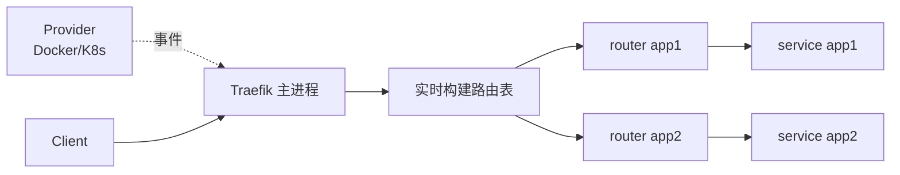

<KeyIdea>
**一句话**：Traefik 通过 **Provider（Docker / K8s / Consul）** 自动发现服务，**无需重启 / 无需手写后端列表**。新容器一启动它就接进流量；停掉就立刻摘除。容器时代的事实标准之一。
</KeyIdea>

## 是什么

```yaml
# docker-compose.yml 片段
services:
  traefik:
    image: traefik:v3
    command:
      - --api.insecure=true
      - --providers.docker
      - --entrypoints.web.address=:80
      - --entrypoints.websecure.address=:443
      - --certificatesresolvers.le.acme.tlschallenge=true
      - --certificatesresolvers.le.acme.email=you@example.com
    ports: ["80:80", "443:443", "8080:8080"]
    volumes: ["/var/run/docker.sock:/var/run/docker.sock:ro"]

  app:
    image: my-app
    labels:
      - traefik.enable=true
      - traefik.http.routers.app.rule=Host(`api.example.com`)
      - traefik.http.routers.app.tls.certresolver=le
```

部署 app 时**只贴 label**，路由 / TLS 自动生效。

## 打个比方

<Analogy>
nginx / HAProxy 像**手动设置导航**：每加一站都要进配置文件改地址。  
Traefik 像**自动发现的智能导航**：你随时上车下车，它**实时识别**新加的站点，自动规划路线。
</Analogy>

## 关键概念

<Terms items={[
  { term: "EntryPoint", en: "入口点", def: "监听端口，比如 web=80, websecure=443。" },
  { term: "Router", en: "路由器", def: "匹配规则（Host / Path / Method）→ 指向 Service。" },
  { term: "Service", en: "服务", def: "一组后端实例，自动从 provider 发现。" },
  { term: "Middleware", en: "中间件", def: "压缩、重写、限流、鉴权等可叠加的处理链。" },
  { term: "Provider", en: "服务发现源", def: "Docker、K8s Ingress、CRD、Consul、文件 ……" },
  { term: "Dashboard", en: "管理面", def: "默认 :8080 内置图形化路由可视化（生产记得鉴权或关闭）。" },
]} />

## 怎么工作



新加 / 停 / 升级容器时 Traefik 在毫秒内更新内部路由表。

## 实操要点

- **K8s Ingress 替代品**：用 Traefik IngressRoute CRD 比原生 Ingress 表达力强（中间件链、TCP/UDP 路由）。
- **TLS 一键 ACME**：HTTP / TLS-ALPN / DNS challenge 都支持。多域名时建议 DNS challenge。
- **生产暴露 dashboard**：必须加 BasicAuth 或 IP 白名单，否则等于裸奔。
- **滚动发布**：Traefik 自动跟 Docker / K8s 状态切流量，无需特殊配置。
- **TCP / UDP 路由**：`tcp.routers.xxx.rule=HostSNI(...)` 也能反代数据库 / SSH 等。
- **可观测性**：内置 Prometheus / OpenTelemetry exporter，开起来即可。

## 易混点

<Compare
  leftTitle="Traefik"
  rightTitle="nginx Ingress"
  left={<>
    K8s 原生体验、CRD、动态。<br />
    Go 实现，扩展插件以 wasm 为主。
  </>}
  right={<>
    nginx 内核，老牌稳定。<br />
    动态配置弱，需要 reload。
  </>}
/>

## 延伸阅读

- [nginx](/network/ecosystem/nginx)
- [Caddy](/network/ecosystem/caddy)
- [负载均衡](/network/advanced/load-balancing)
