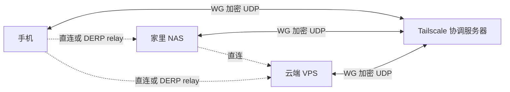

<KeyIdea>
**一句话**：**WireGuard** 是内核级 UDP VPN，配置极简、性能极高、加密现代。**Tailscale** 在 WireGuard 上加了一层「**自动组网 + NAT 穿透 + 身份认证**」，让你点几下就能把多台设备连成同一个内网。
</KeyIdea>

## 是什么

WireGuard 配置只有几行：

```ini
[Interface]
PrivateKey = ...
Address = 10.0.0.2/24
ListenPort = 51820

[Peer]
PublicKey = ...
AllowedIPs = 10.0.0.1/32
Endpoint = 1.2.3.4:51820
PersistentKeepalive = 25
```

公钥相当于身份。来源 IP 不重要 —— 只要密钥对得上就放行。

## 打个比方

<Analogy>
**WireGuard** 像**点对点的加密绳**：你两边各拿一头打结，拉直就能传信。  
**Tailscale** 像**自来水公司**：你在每个房子里装个水龙头（客户端），后台**自动铺管道**（NAT 穿透 + 协调），你打开龙头就有水。
</Analogy>

## 关键概念

<Terms items={[
  { term: "Peer", en: "对等节点", def: "WireGuard 没有 client/server 之分，每个节点都是 peer。" },
  { term: "AllowedIPs", en: "允许 IP", def: "决定哪些目标 IP 走这条隧道 —— 路由表的核心。" },
  { term: "Roaming", en: "漫游", def: "WireGuard 自动跟踪对端的当前公网 IP / 端口，IP 变了也不掉线。" },
  { term: "Tailnet", en: "Tailscale 网络", def: "你的整个虚拟内网，每个设备一个 100.x.x.x 地址。" },
  { term: "MagicDNS", en: "魔术 DNS", def: "Tailscale 自动让设备名直接解析（laptop.tailnet.ts.net）。" },
  { term: "Subnet Router / Exit Node", en: "子网路由 / 出口节点", def: "Tailscale 让某节点把整个子网或公网出口都暴露给 tailnet。" },
]} />

## 怎么工作



Tailscale 控制面**只协调密钥 + 发现**，数据面是**点对点 WireGuard**。

## 实操要点

- **WireGuard 自管 vs Tailscale 托管**：自管适合极致性能 / 不想依赖第三方；多设备 + 跨 NAT 强烈推荐 Tailscale。
- **Tailscale 个人免费档**：100 设备 + 3 用户，足够个人 / 家庭。
- **对接 K8s**：Tailscale Kubernetes Operator 把整个集群接进 tailnet。
- **结合 Caddy / Cloudflare Tunnel**：tailnet 内访问 + 外网通过 Cloudflare Tunnel 暴露选定服务，**不开公网端口**。
- **MTU 注意**：WG 默认 1420，叠多层（VPN over VPN / 卫星网络）要再降。
- **审计**：Tailscale 提供 Network Flow Logs；自管 WG 用 iptables / nftables 计数。

## 易混点

<Compare
  leftTitle="WireGuard 自管"
  rightTitle="Tailscale"
  left={<>
    一切自己来：分发 key、改路由、打洞。<br />
    极致性能与控制。
  </>}
  right={<>
    自动组网 / NAT 穿透 / SSO。<br />
    依赖控制面（可自托管 Headscale）。
  </>}
/>

## 延伸阅读

- [NAT](/network/beginner/nat)
- [TLS 握手细节](/network/advanced/tls-handshake)
- [Cloudflare](/network/ecosystem/cloudflare) —— Tunnel 也是隧道穿透方案
