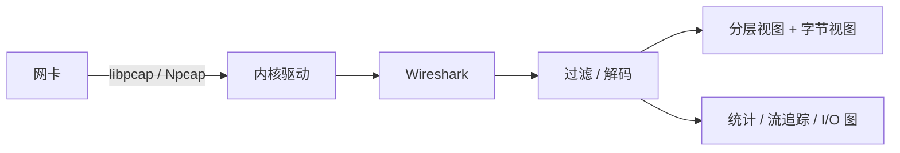

<KeyIdea>
**一句话**：Wireshark 抓下网卡上的每一个数据包，**按协议分层展开**给你看 —— Frame / IP / TCP / TLS / HTTP 一目了然。所有学过的协议都能在它里面**亲眼看到**，调试网络问题最强武器。
</KeyIdea>

## 是什么

启动后选网卡 → 立刻看到包流过 → 输入过滤表达式定位：

```
ip.addr == 10.0.0.5
tcp.port == 443
http.request
tls.handshake.type == 1     # ClientHello
tcp.flags.reset == 1        # 找 RST
```

任何一个包点开都能**逐层展开**：Ethernet → IP → TCP → 应用层。

## 打个比方

<Analogy>
Wireshark 像**网络的高速摄像机**：能把肉眼看不见的「**这一秒里到底发生了什么**」放慢、放大、逐帧回放。
</Analogy>

## 关键概念

<Terms items={[
  { term: "Capture Filter", en: "抓取过滤", def: "BPF 语法，决定**抓什么**（如 `tcp port 443`）。捕获时生效，量大时必用。" },
  { term: "Display Filter", en: "显示过滤", def: "Wireshark 自家语法（如 `tcp.port == 443`），抓完之后筛。" },
  { term: "Follow Stream", en: "流追踪", def: "右键 → Follow → TCP/HTTP/TLS Stream，把整段对话拼好。" },
  { term: "I/O Graph", en: "I/O 图", def: "看 RTT / 重传率 / 吞吐随时间变化。" },
  { term: "TLS 解密", en: "Decryption", def: "导入 SSLKEYLOGFILE 后能解明文（仅本机生成的 TLS 流量）。" },
  { term: "tshark", en: "命令行版", def: "无 GUI 抓包，CI / 远程服务器上常用。" },
]} />

## 怎么工作



驱动层把每个包复制一份给抓包进程，**不影响**正常通信。

## 实操要点

- **服务器无 GUI**：用 `tcpdump -i any -w out.pcap` 抓，下载到本机用 Wireshark 打开。
- **常用 capture filter**：`host 1.2.3.4 and port 443`、`tcp[tcpflags] & (tcp-syn|tcp-rst) != 0`。
- **解密 HTTPS**：Chrome 启动时设环境变量 `SSLKEYLOGFILE=/tmp/keys.log`，Wireshark 在 Preferences → TLS 里指过去。
- **HTTP 抓不到内容**：先确认是不是 HTTPS（443 + TLS）；HTTP/2 / HTTP/3 / gRPC 都需要在 Preferences 里开对应解析。
- **分析慢请求**：`Statistics → Conversations → TCP` 看每条流的 RTT、字节数；`Expert Info` 直接列出重传 / 失序。
- **抓包是有创成本的高负载**：生产环境用 `-W` 限文件 / `-G` 限时长，不要无脑抓到磁盘满。

## 易混点

<Compare
  leftTitle="Wireshark"
  rightTitle="curl -v"
  left={<>
    **真实网络层**抓到的字节。<br />
    能看 TLS 握手 / 重传 / 丢包。
  </>}
  right={<>
    应用层视角。<br />
    看 header 和响应体，看不到 TCP 细节。
  </>}
/>

## 延伸阅读

- [封装与解封装](/network/beginner/encapsulation)
- [TCP 三次握手](/network/advanced/tcp-handshake)
- [TLS 握手细节](/network/advanced/tls-handshake)
