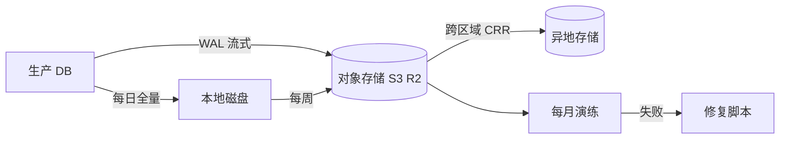

<KeyIdea>
**一句话**：备份的**唯一目的**是恢复。**3 份副本、2 种介质、1 份异地** + **定期演练恢复**，缺一项都不算合格。
</KeyIdea>

## 3-2-1 原则

```
3 份副本：原 + 本地副本 + 异地副本
2 种介质：本地磁盘 + 对象存储 / 磁带
1 份异地：另一个机房 / 另一个区域 / 另一个云
```

再叠加：**至少 1 份不可变**（防勒索软件；S3 Object Lock / WORM）。

## 打个比方

<Analogy>
没备份 = **唯一钥匙挂在裤兜**：丢了进不去家门。  
备份 = **保险柜里多刻几把钥匙**：丢一把还有备份；放在不同地方 = 一栋楼烧了**还有外面那把**。
</Analogy>

## 关键概念

<Terms items={[
  { term: "RTO", en: "Recovery Time Objective", def: "恢复目标耗时。出事后多久能上线。" },
  { term: "RPO", en: "Recovery Point Objective", def: "数据恢复点。能容忍丢多少时间的数据。" },
  { term: "全量 / 增量 / 差异", en: "Full / Incremental / Differential", def: "全量大；增量小但恢复要叠所有；差异折中。" },
  { term: "PITR", en: "Point-in-Time Recovery", def: "恢复到任意时间点（数据库 WAL 日志）。" },
  { term: "演练", en: "Disaster Recovery Drill", def: "定期把备份恢复到测试环境，跑通 → 才算「**有效备份**」。" },
  { term: "WORM / Object Lock", en: "不可变", def: "对象存储一段时间内不能删 / 改，**抵御勒索 + 误删**。" },
]} />

## 常见数据类型与方案

<KV items={[
  { k: "PostgreSQL / MySQL", v: "pg_basebackup + WAL 流式归档 / mysqlbackup + binlog → S3。PITR 必备。" },
  { k: "Redis", v: "RDB 快照 + AOF。生产组合开。" },
  { k: "对象存储", v: "跨区域 / 跨云复制（CRR）。S3 → R2、OSS → COS 等。" },
  { k: "K8s 配置 + PVC", v: "Velero 备份 etcd 对象 + 卷快照。" },
  { k: "代码", v: "镜像仓库 + git 自身就是分布式备份；再加一份 GitHub → 自托管 Gitea / GitLab 镜像。" },
  { k: "整机 / VM", v: "云快照定时拍 + 异地拷贝。" },
]} />

## 怎么工作



**每月做一次完整恢复演练**是最容易省略也最关键的一步。

## 实操要点

- **写下 RTO / RPO 目标**：再倒推方案。「我要 1 小时恢复 + 5 分钟丢失」 vs 「3 天恢复 + 1 天丢失」差出 10 倍成本。
- **加密备份**：S3 Server-Side Encryption + 客户端密钥（KMS）；异地副本也加密。
- **生命周期策略**：日 - 30 天保留、月 - 12 个月、年 - 5 年。多层成本下降。
- **演练自动化**：每月恢复一份到测试环境跑健康检查，**通知失败就告警**。
- **删除策略**：分离「备份系统」与「生产权限」，运维即使被拿到生产也不能删备份。
- **监控备份本身**：备份失败、上传失败、跨区域复制延迟，全部入 Prometheus 告警。
- **不要把备份只放在原账号 / 原集群**：账号被入侵 → 备份一并被清。

## 易混点

<Compare
  leftTitle="备份"
  rightTitle="高可用 (HA)"
  left={<>
    防**数据丢失 / 逻辑误操作**。<br />
    历史副本，可时间穿越。
  </>}
  right={<>
    防**实例 / 机房不可用**。<br />
    实时同步，**误删立刻同步出去**。
  </>}
/>

## 延伸阅读

- [性能调优](/ops/advanced/performance-tuning)
- [安全加固](/ops/advanced/security-hardening)
- [基础设施即代码](/ops/advanced/iac)
