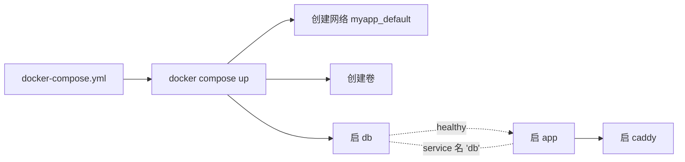

<KeyIdea>
**一句话**：Compose 让你用**一个 docker-compose.yml** 把数据库 / 缓存 / 应用 / Nginx 全描述清楚，**`docker compose up`** 一条命令拉起来，**`down`** 全干净撤掉。**单机部署 / 本地开发**最快路径。
</KeyIdea>

## 一份典型 compose

```yaml
services:
  db:
    image: postgres:16-alpine
    restart: always
    environment:
      POSTGRES_PASSWORD: ${DB_PASSWORD}
    volumes:
      - dbdata:/var/lib/postgresql/data
    healthcheck:
      test: ["CMD", "pg_isready", "-U", "postgres"]
      interval: 5s
      timeout: 3s
      retries: 5

  app:
    build: .
    environment:
      DATABASE_URL: postgres://postgres:${DB_PASSWORD}@db:5432/app
    depends_on:
      db:
        condition: service_healthy
    ports:
      - "3000:3000"

  caddy:
    image: caddy:2
    ports:
      - "80:80"
      - "443:443"
    volumes:
      - ./Caddyfile:/etc/caddy/Caddyfile
      - caddydata:/data
    depends_on:
      - app

volumes:
  dbdata:
  caddydata:
```

启动：

```bash
docker compose up -d
docker compose logs -f app
docker compose ps
docker compose down              # 停容器（保留卷）
docker compose down -v           # 同时删卷
```

## 打个比方

<Analogy>
单跑 docker run = **手动一台台开机**。  
compose = **总开关 + 接线图**：一拨闸所有机器按依赖顺序起来，关闸再按顺序熄。
</Analogy>

## 关键概念

<Terms items={[
  { term: "service", en: "服务", def: "compose 里一个容器（也可多副本）。其它服务用 service 名字互访。" },
  { term: "network", en: "网络", def: "默认每个 compose 项目一个 bridge 网络，所有服务自动加入。" },
  { term: "volume", en: "命名卷", def: "数据持久化。`docker volume ls` 能看到。" },
  { term: "depends_on + healthcheck", en: "依赖与就绪", def: "depends_on 只是启动顺序；要真正等就绪必须配合 healthcheck。" },
  { term: "profiles", en: "配置档", def: "标记服务在 `--profile dev` 时才启动，方便区分线上 / 调试。" },
  { term: "override", en: "覆盖文件", def: "docker-compose.override.yml 自动叠加，本地差异化配置。" },
]} />

## 怎么工作



容器之间通过**服务名**自动 DNS 解析（`db:5432`），不用关心 IP。

## 实操要点

- **生产单机部署足够好**：很多个人 / 小团队项目，**Compose + 一台 VPS 就够**，不必上 K8s。
- **变量统一 `.env`**：`docker compose up` 自动读项目根 `.env`。
- **覆盖文件**：本地用 `docker-compose.override.yml` 暴露调试端口、挂代码热更，生产 `docker compose -f compose.yml -f compose.prod.yml up`。
- **滚动升级**：compose v2 `up -d --no-deps --build app` 能不动 db 只重启 app。
- **健康检查必加**：尤其 db / 缓存。否则 app 启动时连不上崩。
- **资源限制（Compose v2 spec）**：`deploy.resources.limits.cpus / memory`。
- **不要把状态藏在 bind mount**：用命名卷便于备份、迁移。

## 易混点

<Compare
  leftTitle="docker-compose v1"
  rightTitle="docker compose (v2)"
  left={<>
    Python 写的独立工具。<br />
    早已停止维护。
  </>}
  right={<>
    内置在 docker CLI（Go 写）。<br />
    生产用这个。
  </>}
/>

## 延伸阅读

- [Docker 容器入门](/ops/advanced/docker)
- [Dockerfile](/ops/advanced/dockerfile)
- [1Panel / Coolify](/ops/ecosystem/1panel-coolify) —— 单机部署的"图形化 compose"
