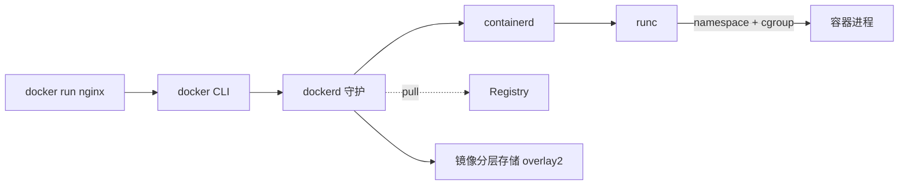

<KeyIdea>
**一句话**：容器不是「轻量虚拟机」，而是**用内核命名空间（namespace）+ cgroup 把进程和文件系统隔开**的运行单元。Docker 在此之上加了**镜像分层 + 标准接口 + 友好 CLI**，让分发和运行变成「pull + run」两条命令。
</KeyIdea>

## 是什么

```bash
# 一条命令把 nginx 跑起来
docker run -d --name web -p 8080:80 nginx:1.27

# 看
docker ps
docker logs web -f
docker exec -it web sh

# 收
docker stop web && docker rm web
```

镜像 (image) = 只读的层叠文件系统；容器 (container) = 镜像之上加一层可写层 + 运行时进程。

## 打个比方

<Analogy>
**虚拟机** = **完整公寓**：自己的水电气网（独立内核），重，但完全隔离。  
**容器** = **共享楼宇里的独立房间**：共享内核（楼），但有自己的门锁（namespace）、电表（cgroup）、家具（文件系统）。
</Analogy>

## 关键概念

<Terms items={[
  { term: "Image", en: "镜像", def: "应用 + 依赖 + 系统库的只读快照。分层存储，复用基础层。" },
  { term: "Container", en: "容器", def: "一个跑起来的镜像实例，有自己的 PID / 网络 / 文件系统。" },
  { term: "Volume", en: "卷", def: "持久化数据。容器删了卷还在。" },
  { term: "Network", en: "网络", def: "默认 bridge；自定义网络让容器互相按名字访问。" },
  { term: "Registry", en: "镜像仓库", def: "Docker Hub / GHCR / 私有 Harbor。push / pull 都通过它。" },
  { term: "OCI", en: "标准规范", def: "镜像格式和运行时标准，让 Podman / containerd 都能跑 Docker 镜像。" },
]} />

## 怎么工作



底层是内核 namespace + cgroup，**没有「Docker 内核」这种东西**。

## 实操要点

- **镜像别用 `latest`**：用具体 tag 或 digest。生产严禁 latest 漂移。
- **`-p host:container`**：宿主端口 → 容器端口；不开就只在 docker 内网访问。
- **`-v /host:/container`**：挂载宿主目录；存数据用命名卷 `-v dataname:/path`。
- **环境变量**：`-e KEY=VAL` 或 `--env-file .env`。
- **资源限制**：`--cpus 1.5 --memory 1g`，否则一个容器能撑爆主机。
- **日志驱动**：默认 json-file，**生产改 journald 或转发到 ELK / Loki**，不然磁盘会爆。
- **`docker system df / prune`** 清理悬挂镜像 / 卷 / 网络。
- **不要用 root 运行**：Dockerfile 里 `USER` 切非特权用户，结合 `--read-only` + `--cap-drop=ALL` 加固。

## 常见错误

- **容器一启动就退出**：主进程结束了。容器**没有「后台」概念**，前台进程退出 = 容器结束。
- **localhost 连不到容器内 DB**：容器视角的 localhost 是它自己。用 `host.docker.internal` 或加同一网络。
- **容器里时区不对**：挂 `-v /etc/localtime:/etc/localtime:ro` 或设 `TZ`。
- **网络变慢**：检查是不是 `--network=host`（共享宿主）和 bridge 网关 MTU 问题。

## 易混点

<Compare
  leftTitle="Image"
  rightTitle="Container"
  left={<>
    模板，**只读**。<br />
    一份镜像可以跑 N 个容器。
  </>}
  right={<>
    运行实例，**可写**。<br />
    停了删了不影响镜像。
  </>}
/>

## 延伸阅读

- [Dockerfile](/ops/advanced/dockerfile)
- [Docker Compose](/ops/advanced/docker-compose)
- [Kubernetes 核心概念](/ops/advanced/k8s-core)
