<KeyIdea>
**一句话**：Dockerfile 每条指令是**一层**，**层是可缓存的、按顺序追加的**。理解层 + 缓存 + 多阶段构建，能把镜像从 1.2 GB 砍到 80 MB。
</KeyIdea>

## 一个好 Dockerfile（Node 例）

```dockerfile
# ---- builder ----
FROM node:20-alpine AS builder
WORKDIR /app
COPY package.json pnpm-lock.yaml ./
RUN corepack enable && pnpm install --frozen-lockfile
COPY . .
RUN pnpm build

# ---- runtime ----
FROM node:20-alpine
WORKDIR /app
ENV NODE_ENV=production
COPY --from=builder /app/.next ./.next
COPY --from=builder /app/public ./public
COPY --from=builder /app/package.json ./
COPY --from=builder /app/node_modules ./node_modules
EXPOSE 3000
USER node
CMD ["node", "node_modules/next/dist/bin/next", "start"]
```

构建：

```bash
docker build -t myapp:0.1 .
docker build --platform linux/amd64,linux/arm64 -t myapp:0.1 . --push  # buildx
```

## 打个比方

<Analogy>
镜像像**一摞透明胶片**：一层叠一层，最终透出最上面的画面（容器内的文件系统）。**改了下层，上层全部要重画 → 缓存失效**；改了上层（如代码），下层（依赖）不动 → 秒级重建。
</Analogy>

## 关键概念

<Terms items={[
  { term: "层", en: "Layer", def: "RUN / COPY / ADD 各产生一层。MAGIC 是 layer 之间可缓存。" },
  { term: "缓存键", en: "Cache Key", def: "由本条指令 + 上层校验和决定。所以**先 COPY package.json 再 install** 比一起 COPY 强。" },
  { term: "多阶段构建", en: "Multi-stage", def: "FROM ... AS builder + 最后阶段只 COPY 产物 → 把工具链丢掉，镜像极小。" },
  { term: ".dockerignore", en: "忽略文件", def: "node_modules、.git、构建产物 —— 不要拷进 builder。" },
  { term: "BuildKit / buildx", en: "现代构建后端", def: "并行构建、跨架构、缓存挂载。生产必开。" },
  { term: "Distroless / scratch", en: "极小基底", def: "只放二进制 + 必需库，无 shell。**安全 + 小**，但调试不便。" },
]} />

## 怎么工作

```mermaid
flowchart LR
    DF[Dockerfile] --> BK[BuildKit]
    BK --> L1[FROM 基底]
    L1 --> L2[WORKDIR]
    L2 --> L3[COPY package.json]
    L3 --> L4[RUN pnpm install]
    L4 --> L5[COPY 源码]
    L5 --> L6[RUN pnpm build]
    L6 --> Stage2[FROM 运行时]
    Stage2 --> R1[COPY --from=builder 产物]
    R1 --> Img[最终镜像]
```



每层都有自己的 sha256，远端 push 只传新层。

## 实操要点

- **顺序**：变化最少的放上层（基础镜像 / 依赖），最常改的放下层（源码）。
- **`COPY` 优于 `ADD`**：ADD 有自动解压 / URL 下载等魔法，**容易踩坑**。
- **少用 `RUN`**：每条 RUN 一层。多个 shell 命令用 `&&` 串成一条。
- **删完才小**：`apt-get install -y X && apt-get clean && rm -rf /var/lib/apt/lists/*` —— 不删依赖文件层照样存在。
- **`HEALTHCHECK`**：写在 Dockerfile 里，平台层（Compose / K8s）能自动判定。
- **`ENV NODE_ENV=production`** + `--frozen-lockfile`：可重现构建。
- **不打 `latest`**：CI 打 `:1.2.3` + `:1.2` + `:1` 三条标签，方便回滚。
- **多架构**：`docker buildx create --use`，然后 `--platform linux/amd64,linux/arm64`。

## 常见反模式

- **直接用 `node:20`**：~1 GB；改 `node:20-alpine` 或 `node:20-slim`。
- **构建期装的 gcc / make 进了运行时**：上多阶段构建。
- **代码改一行重新装依赖**：先 COPY 锁文件再 install。
- **secrets 硬编码到镜像**：用 BuildKit `--mount=type=secret`，绝不写进层。

## 易混点

<Compare
  leftTitle="docker build"
  rightTitle="docker buildx"
  left={<>
    传统单架构构建。<br />
    无并行、缓存简单。
  </>}
  right={<>
    BuildKit 加持，**多平台 + 远端缓存**。<br />
    现在的默认。
  </>}
/>

## 延伸阅读

- [Docker 容器入门](/ops/advanced/docker)
- [Docker Compose](/ops/advanced/docker-compose)
- [安全加固](/ops/advanced/security-hardening)
