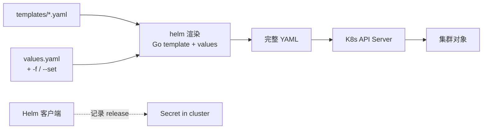

<KeyIdea>
**一句话**：Helm 是 K8s 的**包管理器**。一个 Chart = 一组 Go 模板化的 YAML + 默认值。**`helm install`** 把它渲染成具体资源装到集群，**`helm upgrade --atomic`** 失败自动回滚。
</KeyIdea>

## 是什么

```
my-chart/
├── Chart.yaml         # name / version / appVersion
├── values.yaml        # 默认值
├── templates/
│   ├── deployment.yaml
│   ├── service.yaml
│   └── ingress.yaml
└── charts/            # 依赖
```

`templates/deployment.yaml` 用 Go 模板：

```yaml
apiVersion: apps/v1
kind: Deployment
metadata:
  name: {{ include "my-chart.fullname" . }}
spec:
  replicas: {{ .Values.replicaCount }}
  template:
    spec:
      containers:
        - name: app
          image: "{{ .Values.image.repository }}:{{ .Values.image.tag }}"
          resources: {{- toYaml .Values.resources | nindent 12 }}
```

```bash
helm install my-app ./my-chart -f values-prod.yaml
helm upgrade --install my-app ./my-chart -f values-prod.yaml --atomic --wait
helm rollback my-app 3
helm list
```

## 打个比方

<Analogy>
直接写 K8s YAML 像**手写每一份合同**：写错一个字段重写一份。  
Helm 像**带变量的合同模板**：客户名字、金额、条款是参数，**生成一份 PDF**。
</Analogy>

## 关键概念

<Terms items={[
  { term: "Chart", en: "图表", def: "Helm 的包格式。" },
  { term: "Release", en: "发布", def: "Chart 装到集群里的一个实例。同一个 Chart 可装多次（不同 release name）。" },
  { term: "Values", en: "值", def: "渲染模板时注入的参数；values.yaml 默认 + -f 覆盖 + --set 命令行覆盖。" },
  { term: "Repository", en: "仓库", def: "公共 / 私有 Chart 仓库（Artifact Hub / OCI registry）。" },
  { term: "Hooks", en: "钩子", def: "pre-install / post-upgrade / pre-delete 等生命周期钩子。" },
  { term: "Atomic / Wait", en: "原子升级", def: "`--atomic` 失败回滚；`--wait` 等所有资源 Ready 再返回。" },
]} />

## 怎么工作



每次 install / upgrade 都把 release 历史以 Secret 形式存集群里 → 才能回滚。

## 实操要点

- **善用社区 Chart**：Bitnami / cert-manager / ingress-nginx / loki-stack —— 直接 `helm install`，比抄 YAML 快多了。
- **不要 fork Chart 改源**：用 `values.yaml` 覆盖；真要改用 `umbrella chart` 包一层。
- **CI/CD 集成**：Argo CD / Flux 都原生支持 Helm，写在 GitOps 仓库里。
- **`helm template` 调试**：本地渲染出 YAML 检查再 apply，避免 `helm install` 失败搞乱集群。
- **`--atomic` + `--wait`**：生产升级标配，失败自动回。
- **机密别写 values**：用 sealed-secrets / external-secrets / SOPS 加密。
- **Chart 版本 vs 应用版本**：`Chart.yaml` 里 `version` 是 Chart 自己版本，`appVersion` 是被打包应用版本。

## 易混点

<Compare
  leftTitle="Helm Chart"
  rightTitle="Kustomize"
  left={<>
    模板 + 参数注入。<br />
    适合**发布给别人**用的标准化包。
  </>}
  right={<>
    叠加 patch，**不引入模板语法**。<br />
    适合自己内部定制。
  </>}
/>

## 延伸阅读

- [Kubernetes 核心概念](/ops/advanced/k8s-core)
- [Pod / Service / Ingress](/ops/advanced/pod-service-ingress)
- [Argo CD](/ops/ecosystem/argocd) —— 把 Helm + GitOps 串起来
