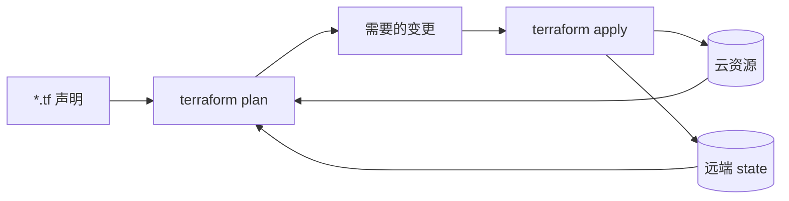

<KeyIdea>
**一句话**：IaC 用**声明式代码**描述「我要什么云资源」（VPC / VM / 数据库 / DNS），工具根据当前状态计算差量后**自动创建 / 修改 / 删除**。结果：环境可重建、PR 可审查、回滚有记录。
</KeyIdea>

## 是什么

```hcl
# main.tf —— 用 Terraform 声明 AWS 资源
provider "aws" { region = "us-east-1" }

resource "aws_vpc" "main" {
  cidr_block = "10.0.0.0/16"
  tags       = { Name = "prod" }
}

resource "aws_instance" "web" {
  ami           = "ami-0abcd"
  instance_type = "t3.small"
  subnet_id     = aws_subnet.public.id
  user_data     = file("${path.module}/cloud-init.yml")
  tags          = { Name = "web-1" }
}
```

```bash
terraform init
terraform plan          # 看会做什么
terraform apply         # 真做
terraform destroy       # 删
```

## 打个比方

<Analogy>
不用 IaC = **手工捏陶瓷**：每次都凭手感、不可复制、坏了重做。  
IaC = **3D 模型 + 打印机**：图纸（代码）一份就能反复印，**两个一模一样**。
</Analogy>

## 关键概念

<Terms items={[
  { term: "声明式", en: "Declarative", def: "你说要什么状态，工具算差量。区别于 shell 脚本「这一步那一步」的命令式。" },
  { term: "状态文件", en: "State", def: "Terraform 的 .tfstate 记录「当前云上是什么」。**必须远端共享 + 锁**（S3 + DynamoDB / GCS / Terraform Cloud）。" },
  { term: "Provider", en: "提供方", def: "AWS / GCP / Azure / Cloudflare / GitHub —— 几乎所有云资源都有 provider。" },
  { term: "Module", en: "模块", def: "可复用的资源组合，类似函数。" },
  { term: "Drift", en: "漂移", def: "云上被人手动改了 → 实际与代码不一致。`terraform plan` 能发现。" },
  { term: "OpenTofu", en: "Terraform 分叉", def: "Terraform 改 BSL 协议后由社区 fork 出来的开源版本。" },
]} />

## 主流工具对比

<KV items={[
  { k: "Terraform / OpenTofu", v: "HCL DSL，最广。多云通用。" },
  { k: "Pulumi", v: "用 Python / TS / Go 真编程语言写 IaC。" },
  { k: "AWS CDK", v: "也是真编程语言，编译成 CloudFormation。仅 AWS。" },
  { k: "CloudFormation / ARM / Deployment Manager", v: "云厂商原生。" },
  { k: "Crossplane", v: "把云资源当 K8s CRD 管。" },
  { k: "Ansible", v: "更偏 OS 内配置（包 / 文件 / 服务），但也能管基础设施。" },
]} />

## 怎么工作



每次 apply 就是「**读 state + 读云 + 看代码 → 计算差量 → 调云 API**」。

## 实操要点

- **状态文件远端 + 锁**：本地 state 是新手坑。多人协作必远端 + 锁。
- **`plan` 当审查工件**：CI 把 `terraform plan` 输出贴到 PR，merge 之后再 `apply`。
- **资源命名 + 标签**：所有资源加 env / owner / project 标签，方便清账单。
- **不要全部 一个 root module**：按 region / env / 组件分仓 + 模块化，blast radius 可控。
- **机密**：用 Vault / SOPS / Secrets Manager；不要 push tfvars 进 git。
- **删资源谨慎**：`terraform destroy` 不可撤销 —— 关键资源加 `prevent_destroy = true`。
- **Drift 检测**：定时 `plan` 报告漂移，发现手动改动；坚决「**改回代码**」而不是反向修代码。

## 易混点

<Compare
  leftTitle="IaC（云资源）"
  rightTitle="配置管理（Ansible / Chef）"
  left={<>
    创建 / 改 / 删**云对象**：VM、VPC、DB。<br />
    Terraform / Pulumi。
  </>}
  right={<>
    在已有机器上**装包 / 配文件 / 启服务**。<br />
    Ansible / Chef / Salt。
  </>}
/>

## 延伸阅读

- [CI/CD 流水线](/ops/advanced/cicd-pipeline)
- [Terraform / OpenTofu](/ops/ecosystem/terraform-opentofu)
- [Ansible](/ops/ecosystem/ansible)
