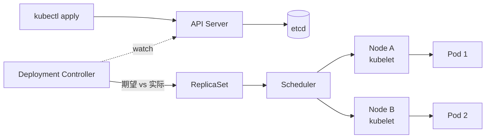

<KeyIdea>
**一句话**：Kubernetes 是**集群级**的容器编排系统。你写「**期望状态**」（YAML），它通过控制循环**不断让现实逼近期望**。看不懂没关系，先把 5 个对象记住：Pod / Deployment / Service / Ingress / Namespace。
</KeyIdea>

## 是什么

```yaml
# Deployment：3 副本的 web
apiVersion: apps/v1
kind: Deployment
metadata: { name: web }
spec:
  replicas: 3
  selector: { matchLabels: { app: web } }
  template:
    metadata: { labels: { app: web } }
    spec:
      containers:
        - name: app
          image: ghcr.io/me/web:1.2.0
          ports: [{ containerPort: 8080 }]
          resources:
            limits: { cpu: 500m, memory: 512Mi }
            requests: { cpu: 100m, memory: 128Mi }
---
# Service：让外部按 DNS 名访问
apiVersion: v1
kind: Service
metadata: { name: web }
spec:
  selector: { app: web }
  ports: [{ port: 80, targetPort: 8080 }]
```

## 打个比方

<Analogy>
你不是直接命令工人「**砌这块砖**」（imperative），你是把**蓝图**（YAML）交给项目经理（控制器），他**带一群人不停巡检**：少了砖就补、错位了就纠正、塌了就重砌 —— 这就是声明式 + 控制循环。
</Analogy>

## 五个最常用对象

<Terms items={[
  { term: "Pod", en: "豆荚", def: "一个或多个紧耦合容器组成的最小调度单元。共享网络命名空间和卷。" },
  { term: "Deployment", en: "部署", def: "管理一组无状态 Pod 的生命周期，提供滚动升级 / 回滚。" },
  { term: "Service", en: "服务", def: "给一组 Pod 套一个稳定 DNS 名 + 虚拟 IP。" },
  { term: "Ingress", en: "入口", def: "L7 路由：把外部域名 / 路径映射到不同 Service（nginx / Traefik 实现）。" },
  { term: "Namespace", en: "命名空间", def: "集群内逻辑分区。dev / prod / kube-system 各自独立。" },
]} />

## 怎么工作



整个 K8s **就是一堆控制器在 watch API server 然后调和状态**。

## 关键命令

```bash
kubectl get pods -A                            # 全集群
kubectl describe pod web-xxxxx
kubectl logs -f web-xxxxx
kubectl exec -it web-xxxxx -- sh
kubectl apply -f manifest.yaml
kubectl rollout status deploy/web
kubectl rollout undo deploy/web
kubectl top pod
kubectl explain deployment.spec.template.spec.containers   # 查字段
```

## 实操要点

- **总写 resources requests/limits**：调度器靠 requests 决定塞哪个节点；limits 防止单 Pod 把节点打爆。
- **不要直接 kubectl exec 改东西**：改 YAML → apply。否则下次 rollout 全丢。
- **健康检查三件套**：`livenessProbe`（活着没）/ `readinessProbe`（能接流量没）/ `startupProbe`（启动期宽容）。
- **Pod 是短命的**：可能随时被驱逐 / 重建，**应用必须无状态**或把状态放 PVC / 外部 DB。
- **滚动发布**：默认 `RollingUpdate`，`maxUnavailable` / `maxSurge` 控制速度。
- **HPA**：`kubectl autoscale deploy/web --cpu-percent=70 --min=2 --max=10`。
- **学习曲线建议**：先 minikube / k3s 跑通 → 部署一个真应用 → 学 Helm 模板 → 再碰 ServiceMesh / Operator。

## 易混点

<Compare
  leftTitle="Pod"
  rightTitle="容器"
  left={<>
    K8s 调度单元，**可包含 1 ~ N 个紧耦合容器**。<br />
    共享网络 + 卷。
  </>}
  right={<>
    Pod 内部的运行实例。<br />
    `containers:` 数组里的一个元素。
  </>}
/>

## 延伸阅读

- [Pod / Service / Ingress 细节](/ops/advanced/pod-service-ingress)
- [Helm](/ops/advanced/helm)
- [Docker Compose](/ops/advanced/docker-compose) —— 单机替代品
