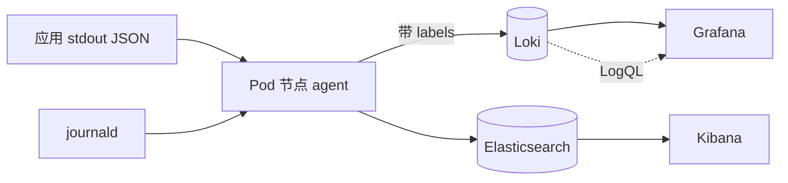

<KeyIdea>
**一句话**：服务到一定规模后，**日志必须中心化** —— 收集 → 解析 → 索引 → 查询 → 告警。主流两条路：**ELK / OpenSearch**（全文索引，强但贵）和 **Loki**（标签索引，省钱够用）。
</KeyIdea>

## 是什么

```
[应用 stdout]  ──┐
[journal]    ──┼──> [采集 agent]──> [中心存储] ──> [查询 UI]
[文件日志]    ──┘    Promtail/Vector/  Loki/ES        Grafana/Kibana
                     Fluent Bit
```

应用**写到 stdout** 是云原生默认；agent 跑在每个节点把日志推到中心。

## 打个比方

<Analogy>
单机日志 = **每家自己写日记**：找事得**挨家敲门翻**。  
日志聚合 = **村办图书馆**：每家把日记**自动送来归档**，全村查找一处搞定。
</Analogy>

## 关键概念

<Terms items={[
  { term: "结构化日志", en: "Structured", def: "JSON 行而非纯文本：`{level, ts, trace_id, msg, ...}`。否则解析全靠 regex。" },
  { term: "Trace ID", en: "追踪 ID", def: "贯穿一次请求的唯一 ID。日志和 Trace 关联的关键。" },
  { term: "采集 agent", en: "Collector", def: "Promtail / Vector / Fluent Bit / OpenTelemetry Collector。" },
  { term: "倒排索引", en: "Inverted Index", def: "ES 给每个 token 建索引，**全文随便搜**，但磁盘 / 内存代价高。" },
  { term: "标签索引 (Loki)", en: "Label Index", def: "只索引 label（service / pod / level），日志体不索引；查询便宜，全文需扫。" },
  { term: "保留期", en: "Retention", def: "热数据 7–30 天 + 冷归档 S3 / OSS 数月。" },
]} />

## 怎么工作



K8s 环境的事实组合：Promtail/Fluent Bit + Loki + Grafana。

## 实操要点

- **应用统一 JSON 日志**：`{"ts":"...","level":"info","trace_id":"abc","msg":"...","fields":{...}}`。
- **关键字段做 label，正文放 message**：service、pod、level、env 适合做 label；user_id、order_id 放 message 里供搜。
- **不要把全部 K8s annotations 当 label**：会让 Loki / ES 索引爆炸。
- **采样高频日志**：debug 级别要么不出生产，要么按比例采样（1/100）。
- **PII 脱敏**：手机号 / 身份证 / token 在 agent 层正则替换 `***`。
- **Trace + Log 互跳**：日志带 trace_id，Grafana 中点 trace_id 跳到 Tempo 看 trace；反向亦可。
- **磁盘保护**：limit log retention + log rotation，避免节点把磁盘写爆。

## 选型

<KV items={[
  { k: "ELK / OpenSearch", v: "强大全文搜索 / 复杂查询。重，贵，运维高。" },
  { k: "Loki + Grafana", v: "标签索引省钱，K8s 体验丝滑。全文检索弱。" },
  { k: "ClickHouse / Doris", v: "海量结构化日志 + SQL 分析。需要建表。" },
  { k: "Datadog / 新增云厂商 SaaS", v: "省心，按 GB 计费，规模上来很贵。" },
]} />

## 易混点

<Compare
  leftTitle="日志"
  rightTitle="指标"
  left={<>
    事件 / 文本，**详细但量大**。<br />
    适合「发生了什么」。
  </>}
  right={<>
    数值 / 时间序列，**汇总后小**。<br />
    适合「现在是什么状态」。
  </>}
/>

## 延伸阅读

- [日志系统（journalctl）](/ops/beginner/log-system)
- [Prometheus 指标模型](/ops/advanced/prometheus-metrics)
- [Loki](/ops/ecosystem/loki)
