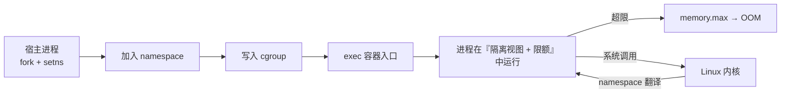

<KeyIdea>
**一句话**：容器不是虚拟机，它就是**一组带『特殊视图』的进程**。这个视图来自 **namespace**（PID / Net / Mount / UTS / IPC / User / Cgroup 七种），资源限额来自 **cgroup v2**。Docker / Podman / containerd 都是这两者的封装器。
</KeyIdea>

## 是什么

```bash
# 直接用 unshare 自己造一个最小容器
sudo unshare --pid --net --mount --uts --ipc --fork --mount-proc /bin/bash
# 进去 ps 看 —— 只看到自己；ip a 看 —— 没有网卡；hostname xxx 不影响外面
```

cgroup v2 用一棵**统一的层级**：

```
/sys/fs/cgroup/                ← cgroup v2 根
  └── system.slice/web.service/
        memory.max     = 512M
        cpu.max        = "20000 100000"   # 20 % 一个 CPU
        pids.max       = 200
```

进程 PID 写入 `cgroup.procs` 即生效。

## 打个比方

<Analogy>
**namespace** = 给进程**戴上 VR 头盔**：他看到的"世界"被换了，但物理硬件没变；
**cgroup** = 给进程**配个食量管家**：每天只能吃多少 CPU、内存、IO，超过就饿死或挨打。
</Analogy>

## 七种 namespace

<KV items={[
  { k: "PID", v: "进程号空间。容器内 PID 1 是它的 init，看不到宿主机进程。" },
  { k: "Net", v: "独立网卡 / 路由 / iptables / 端口。docker 给容器创建一个 veth pair。" },
  { k: "Mount", v: "独立挂载点视图。容器看到的 `/` 是 overlayfs 拼出来的。" },
  { k: "UTS", v: "独立 hostname / domainname。" },
  { k: "IPC", v: "独立 System V IPC / POSIX 消息队列。" },
  { k: "User", v: "UID/GID 映射。容器内 root（uid=0）映射到宿主机的非 root —— rootless 关键。" },
  { k: "Cgroup", v: "限制对 cgroup 树的可见性，避免容器内看到宿主机其它 cgroup。" },
]} />

## cgroup v2 关键控制器

<Terms items={[
  { term: "memory", en: "内存", def: "memory.max 硬限；超过 OOM kill。memory.high 软限触发回收。" },
  { term: "cpu", en: "CPU", def: "cpu.max = quota period；如 50000 100000 = 50%。cpu.weight = 相对权重。" },
  { term: "io", en: "IO", def: "io.max 限制读写带宽 / IOPS（按设备号）。" },
  { term: "pids", en: "进程数", def: "防 fork 炸弹。" },
  { term: "cpuset", en: "CPU 绑核", def: "cpuset.cpus = 0-3 把容器钉在前 4 核。" },
  { term: "freezer", en: "冻结", def: "暂停 / 恢复一组进程，调试和迁移用。" },
]} />

## 怎么工作



每次系统调用，内核根据该进程所在 namespace **返回受限视图**。

## 实操要点

- **直接观察**：`ls /proc/<pid>/ns/` 看进程在哪些 ns；`cat /proc/<pid>/cgroup` 看 cgroup 路径；`systemctl status <svc>` 末尾会列出资源用量（systemd 通过 cgroup v2 控制）。
- **systemd resource control**：`systemctl set-property web.service MemoryMax=1G CPUQuota=50%`，**不重启即生效**。
- **rootless 容器**：靠 user namespace 把宿主机非 root 用户映射成容器内 root，加上 fuse-overlayfs / slirp4netns 处理存储和网络。
- **OOM killer 行为**：cgroup OOM 只杀这个 cgroup 内的进程，**不会波及宿主机其他服务**（这是 docker memory limit 的根本机制）。
- **混部场景**：cpu.weight 比 cpu.max 友好 —— 闲时多用、忙时按比例；适合 K8s 限制 pod 不互踩。
- **cgroup v1 vs v2**：v1 多个层级混乱，v2 统一一棵树。**新内核默认 v2**；旧 K8s + 旧 Docker 可能还在 v1。

## 易混点

<Compare
  leftTitle="namespace"
  rightTitle="cgroup"
  left={<>
    隔离**看到什么**。<br />
    PID / 网络 / 挂载 / 主机名……
  </>}
  right={<>
    限制**用多少**。<br />
    CPU / 内存 / IO / 进程数。
  </>}
/>

## 延伸阅读

- [Docker 容器入门](/ops/advanced/docker)
- [Kubernetes 核心概念](/ops/advanced/k8s-core)
- [Docker / Podman / containerd](/ops/ecosystem/docker-vs-podman)
