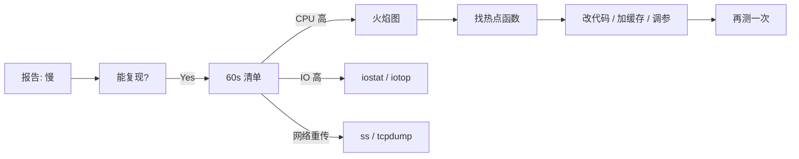

<KeyIdea>
**一句话**：性能问题永远先**测量**再**改**。Brendan Gregg 的 **USE 法**（Utilization / Saturation / Errors）配合**60 秒检查清单**，能 5 分钟定位 80% 瓶颈。
</KeyIdea>

## 60 秒诊断清单

```bash
uptime              # 负载 1/5/15 min；> CPU 数表示堆积
dmesg | tail        # OOM？磁盘错？
vmstat 1 5          # r 列 CPU 排队、si/so swap、wa IO 等待
mpstat -P ALL 1     # 各 CPU 利用率，单核打满 = 可能锁瓶颈
pidstat 1           # 看哪个进程占 CPU
iostat -xz 1        # %util、await
free -m             # 内存 / cache / swap
sar -n DEV 1 5      # 网卡吞吐
sar -n TCP,ETCP 1 5 # TCP retrans / segs
top / htop          # 综合
```

## 打个比方

<Analogy>
性能调优像**医生看病**：先测体温、量血压、做血常规（USE 指标），不是上来就开药（改参数）。
</Analogy>

## USE 法

<Terms items={[
  { term: "Utilization", en: "利用率", def: "资源在多少百分比时间忙。CPU 80%、磁盘 70%。" },
  { term: "Saturation", en: "饱和度", def: "等待资源的队列深度。runq、io 等待、TCP listen overflow。" },
  { term: "Errors", en: "错误", def: "丢包、IO 错误、OOM。" },
]} />

每个资源都按这三个维度看：CPU、内存、磁盘、网络。

## 各维度速查

<KV items={[
  { k: "CPU 利用", v: "top, mpstat" },
  { k: "CPU 饱和", v: "uptime（loadavg），vmstat r 列" },
  { k: "CPU 错误", v: "perf stat（cache miss / branch miss）" },
  { k: "Mem 利用", v: "free, /proc/meminfo" },
  { k: "Mem 饱和", v: "vmstat si/so（swap），dmesg OOM" },
  { k: "Disk 利用", v: "iostat -x %util" },
  { k: "Disk 饱和", v: "iostat await, vmstat wa" },
  { k: "Disk 错误", v: "dmesg, smartctl" },
  { k: "Net 利用", v: "sar -n DEV，nload" },
  { k: "Net 饱和", v: "ss -ti（cwnd, rwnd），netstat -s 看 retrans" },
  { k: "Net 错误", v: "ip -s link，ethtool -S" },
]} />

## 火焰图 + perf

```bash
# 采样 30 秒
sudo perf record -F 99 -ag -- sleep 30
sudo perf script | inferno-flamegraph > flame.svg
```

火焰图 = **横向是采样占比、纵向是调用栈** —— 一眼看出 CPU 时间花在哪。

## 怎么工作



**改了一定要再量一次**，否则可能改的是无关项。

## 实操要点

- **慢有两种**：吞吐慢 / 单请求延迟高。**先确定是哪种**再选工具。
- **不调参先排查**：先看应用 / DB 索引 / 缓存命中，绝大多数瓶颈在应用代码而非内核。
- **CPU 高未必是问题**：批处理跑满 CPU 是好事；**等待时间长**才是坏事。
- **网络看 retrans / TCP 状态分布**：`ss -tan` + `netstat -s`，重传率 > 1% 就要查链路。
- **swap 慎用**：服务器开 swap 通常意味着已经开始滑坡。OOM 直接 kill 反而更可控。
- **eBPF 工具**：bcc / bpftrace 是现代神器（execsnoop / opensnoop / biosnoop / tcptop）。
- **基线很重要**：日常采集指标，出问题对比正常基线，**定位异常**比凭感觉靠谱。

## 易混点

<Compare
  leftTitle="高 load average"
  rightTitle="高 CPU 利用"
  left={<>
    含**等待 IO** 的进程数。<br />
    可能 CPU 不忙但磁盘卡。
  </>}
  right={<>
    CPU 真在跑代码。<br />
    用 perf / 火焰图查热点。
  </>}
/>

## 延伸阅读

- [进程与信号](/ops/beginner/process-signal)
- [日志聚合](/ops/advanced/log-aggregation)
- [Prometheus 指标模型](/ops/advanced/prometheus-metrics)
