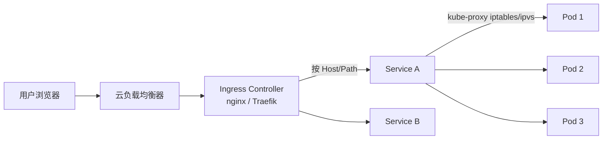

<KeyIdea>
**一句话**：**Pod** 跑容器、**Service** 给一组 Pod 套稳定虚拟 IP + DNS、**Ingress** 把外部域名 / 路径转给 Service。三者堆在一起就是 K8s 的请求路径。
</KeyIdea>

## 是什么

```yaml
# Pod 是工人 —— 通常通过 Deployment 管
# Service 是接待员 —— 把请求轮询转给后端 Pod
apiVersion: v1
kind: Service
metadata: { name: web, namespace: prod }
spec:
  selector: { app: web }
  ports: [{ port: 80, targetPort: 8080 }]
  type: ClusterIP        # 默认 —— 集群内可达
---
# Ingress 是大堂经理 —— 解析 Host / Path 路由
apiVersion: networking.k8s.io/v1
kind: Ingress
metadata:
  name: web
  annotations:
    cert-manager.io/cluster-issuer: letsencrypt
spec:
  ingressClassName: nginx
  rules:
    - host: app.example.com
      http:
        paths:
          - path: /
            pathType: Prefix
            backend:
              service: { name: web, port: { number: 80 } }
  tls:
    - hosts: [app.example.com]
      secretName: web-tls
```

## 打个比方

<Analogy>
Pod = **餐厅厨师**，可能 3 个人在做同一道菜，IP 一直变。  
Service = **传菜员**，对外只一个稳定窗口；按算法把订单发给后厨任一空闲厨师。  
Ingress = **大堂经理**，把客人按预约（Host / Path）领去对应窗口。
</Analogy>

## Service 的几种类型

<KV items={[
  { k: "ClusterIP", v: "默认，集群内访问。配 DNS 名 svc.namespace.svc.cluster.local。" },
  { k: "NodePort", v: "在每个节点开一个 30000–32767 的端口，适合开发 / 调试。" },
  { k: "LoadBalancer", v: "云厂商给你创真负载均衡器（ALB / NLB / SLB），生产暴露用。" },
  { k: "ExternalName", v: "DNS CNAME 到外部域名，比如把 svc 别名指 RDS。" },
  { k: "Headless (clusterIP: None)", v: "不分配 VIP，直接返回所有 Pod 的 IP，StatefulSet 必备。" },
]} />

## 怎么工作



`kube-proxy` 在每个节点维护 iptables/ipvs 规则，把 ClusterIP **DNAT** 到具体 Pod。

## 实操要点

- **Pod IP 不要硬编码**：永远通过 Service DNS（`web.prod.svc.cluster.local`，同 namespace 内省略后两段）。
- **Service 端口名字化**：`ports: [{name: http, port: 80}]`，方便后续 Ingress / NetworkPolicy 引用。
- **Ingress Controller 是「集群外暴露」的主流方案**：装一个就够（nginx / Traefik / Envoy / Caddy）。
- **TLS 自动化**：装 cert-manager，annotation 一行自动签 Let's Encrypt 证书。
- **NodePort / LoadBalancer 与 Ingress 取舍**：NodePort 多了 → 维护成本高；统一走 Ingress + 一个外部 LB 最干净。
- **NetworkPolicy**：默认任意 Pod 互通；上 NetworkPolicy 可限制东西向流量，零信任基础。
- **金丝雀 / 蓝绿**：装 Argo Rollouts 或者 Istio，**比手撸 weights 简单 100 倍**。

## 易混点

<Compare
  leftTitle="Service"
  rightTitle="Ingress"
  left={<>
    集群内**TCP / UDP** 抽象。<br />
    L4。
  </>}
  right={<>
    集群外**HTTP / HTTPS** 路由。<br />
    L7，依赖 controller。
  </>}
/>

## 延伸阅读

- [Kubernetes 核心概念](/ops/advanced/k8s-core)
- [Helm](/ops/advanced/helm)
- [负载均衡](/network/advanced/load-balancing)
