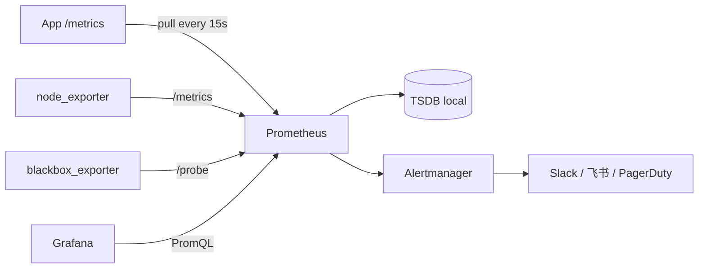

<KeyIdea>
**一句话**：Prometheus 用 **HTTP pull** 周期性抓取每个目标暴露的 `/metrics`，把多维度时间序列存进 TSDB。**指标 + 标签 + PromQL** 是它的全部世界。
</KeyIdea>

## 是什么

每个被监控对象都暴露一个 `/metrics` 端点：

```
# HELP http_requests_total Total HTTP requests
# TYPE http_requests_total counter
http_requests_total{method="GET",status="200",path="/api"} 12345
http_requests_total{method="POST",status="500",path="/api"} 12

# HELP http_request_duration_seconds Latency
# TYPE http_request_duration_seconds histogram
http_request_duration_seconds_bucket{le="0.1"} 9000
http_request_duration_seconds_bucket{le="0.3"} 9800
http_request_duration_seconds_bucket{le="+Inf"} 10000
http_request_duration_seconds_count 10000
http_request_duration_seconds_sum 320.5
```

Prometheus 每 15s 抓一次，TSDB 存下来，Grafana 来查。

## 打个比方

<Analogy>
旧式监控像**把日志一条条邮过去**：写死的、噪声大、查询慢。  
Prometheus 像**给每个对象贴温度计**：自动按时间 + 标签维度（机器名 / 路径 / 状态码）记录数值，**任意切片聚合**。
</Analogy>

## 四种指标类型

<Terms items={[
  { term: "Counter", en: "计数器", def: "只增不减（重启回 0）。常配 rate() 看每秒增量。" },
  { term: "Gauge", en: "仪表盘", def: "可上可下的瞬时值（CPU 使用率、温度、当前连接数）。" },
  { term: "Histogram", en: "直方图", def: "一组桶 _bucket，配合 histogram_quantile() 算 P50/P99 延迟。" },
  { term: "Summary", en: "摘要", def: "客户端预算分位数。**不能跨实例聚合**，故 Histogram 更常用。" },
]} />

## PromQL 速查

```promql
# 每秒 HTTP 请求数
rate(http_requests_total[1m])

# 5xx 比例
sum(rate(http_requests_total{status=~"5.."}[5m]))
  / sum(rate(http_requests_total[5m]))

# P99 延迟
histogram_quantile(0.99, sum by (le) (rate(http_request_duration_seconds_bucket[5m])))

# CPU 利用率
100 - 100 * avg by (instance) (rate(node_cpu_seconds_total{mode="idle"}[5m]))

# 节点内存可用率
node_memory_MemAvailable_bytes / node_memory_MemTotal_bytes
```

## 怎么工作



整个链路：**应用 / exporter 暴露 → Prometheus 抓 → 告警 + 可视化**。

## 实操要点

- **不要把高基数维度放标签**：user_id / 请求 id 当 label 会**爆炸**。标签只放有限枚举（method、status、path 模板）。
- **HTTP 路径要参数化**：`/users/123 / 124 / 125` 都规范成 `/users/:id`，否则路径成了无限维。
- **histogram 桶要对业务有意义**：默认桶通常不够，按你 SLI 把关键阈值设成桶（10ms、50ms、200ms、1s）。
- **node_exporter / cadvisor / kube-state-metrics**：基础三件套，主机 + 容器 + K8s 集群指标全在了。
- **保留时长**：默认本地 15 天；要长期存用 Mimir / Thanos / VictoriaMetrics。
- **告警写在 Alertmanager**：分组 / 抑制 / 静默 三件套；不要每个告警一个 webhook。
- **黄金四指标**：延迟（latency）、流量（traffic）、错误（errors）、饱和度（saturation） —— Google SRE 必背。

## 易混点

<Compare
  leftTitle="Pull (Prometheus)"
  rightTitle="Push (StatsD)"
  left={<>
    服务自己暴露 /metrics，Prom 来抓。<br />
    天然支持服务发现 / 健康检查。
  </>}
  right={<>
    服务把指标推给收集器。<br />
    短任务（cron / Lambda）必须用 Pushgateway 中转。
  </>}
/>

## 延伸阅读

- [日志聚合](/ops/advanced/log-aggregation)
- [Prometheus + Grafana 栈](/ops/ecosystem/prometheus-grafana)
- [系统加固](/ops/advanced/security-hardening)
