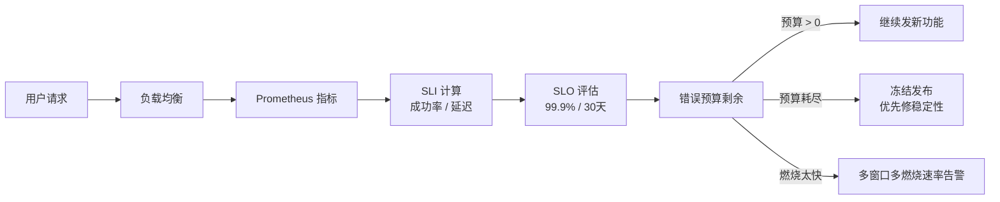

<KeyIdea>
**一句话**：用**指标（SLI）**衡量服务，用**目标（SLO）**承诺一个比例（如 99.9%），剩下的就是**错误预算（Error Budget）**。预算花光，就**冻结新功能上线优先修稳定性** —— 这是 Google SRE 把"研发与运维利益冲突"调和的方式。
</KeyIdea>

## 关键概念

<Terms items={[
  { term: "SLI", en: "Service Level Indicator", def: "**指标本身** —— 例如 'HTTP 请求成功率'、'p99 延迟 < 300ms'。" },
  { term: "SLO", en: "Service Level Objective", def: "**对内目标** —— 例如 '30 天滚动窗口内 SLI 成功率 ≥ 99.9%'。" },
  { term: "SLA", en: "Service Level Agreement", def: "**对外合同** —— 没达到要赔钱 / 退款。SLA < SLO，留缓冲。" },
  { term: "Error Budget", en: "错误预算", def: "100% - SLO 的剩余空间。99.9% / 30 天 = 43.2 分钟可用宕机时间。" },
  { term: "Burn Rate", en: "燃烧速率", def: "实时消耗预算的速度。1h 内消耗 1 周预算 → 'fast burn' 警报。" },
  { term: "Customer-perceived", en: "用户视角", def: "SLI 应反映用户体验（如 LB 出口的成功率），而不是内部组件。" },
]} />

## 经典 SLI 类型

<KV items={[
  { k: "可用性 / 成功率", v: "good_events / total_events，例如非 5xx 比例。" },
  { k: "延迟", v: "P50 / P95 / P99 < 阈值的请求比例。注意延迟不是平均值，是分位数。" },
  { k: "正确性", v: "返回结果正确比例（如订单计算无误）。" },
  { k: "新鲜度", v: "数据更新时间 ≤ X 分钟（搜索、缓存场景）。" },
  { k: "吞吐量", v: "RPS / QPS 满足业务需求（很少作为 SLI，更多作为容量指标）。" },
]} />

## 怎么用

## 实操要点

- **从 1 个 SLO 开始**：每个核心用户旅程定义一个 SLI + SLO；不要一次做 50 个，运营负担太重。
- **窗口选 30 天 rolling**：更短噪声大，更长反应慢。
- **多窗口多燃烧速率告警**（Google SRE 推荐）：`14.4× burn 5min` + `6× burn 1h` + `3× burn 6h` + `1× burn 3d` 共 4 条规则，**少误报，又不漏 slow burn**。
- **SLI ≠ 监控所有指标**：100% 健康检查通过的"灯都是绿的"≠ 用户成功率。**永远以用户视角度量**。
- **错误预算政策（Error Budget Policy）**：白纸黑字写明：**预算 < X% 就停发新功能**。否则没人执行。
- **依赖透明**：你的 SLO 不能比依赖的 SLO 高（你 99.9 而下游 99 = 你不可能达成）。
- **Composite SLO**：多个子 SLI 加权或最差，用于复杂用户旅程（登录 → 浏览 → 购买）。

## 易混点

<Compare
  leftTitle="SLO（对内）"
  rightTitle="SLA（对外）"
  left={<>
    工程团队**自我承诺**。 
    宽松一点，留缓冲。
  </>}
  right={<>
    法务合同 / 钱赔。 
    比 SLO 更宽松，**不要给客户承诺到极限**。
  </>}
/>

## 延伸阅读

- [Prometheus 指标模型](/ops/advanced/prometheus-metrics)
- [日志聚合](/ops/advanced/log-aggregation)
- [性能调优](/ops/advanced/performance-tuning)
