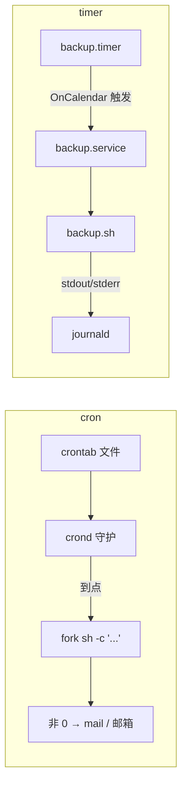

<KeyIdea>
**一句话**：定时跑脚本两套主流方案：传统 **cron**（短小灵活）和现代 **systemd timer**（可观测、有日志、可依赖其他 unit）。生产推荐 timer。
</KeyIdea>

## cron 速通

```cron
# m  h  dom mon dow  command
0    3   *   *   *   /usr/local/bin/backup.sh
*/5  *   *   *   *   curl -fsSL https://example.com/healthz > /dev/null
0    9   *   *   1-5 /opt/scripts/report.sh   # 周一到周五 9 点
@reboot                /opt/scripts/init-once.sh
```

```bash
crontab -e          # 当前用户
crontab -l
sudo crontab -e -u root
```

## systemd timer 速通

`/etc/systemd/system/backup.service`：

```ini
[Unit]
Description=Daily backup

[Service]
Type=oneshot
ExecStart=/usr/local/bin/backup.sh
```

`/etc/systemd/system/backup.timer`：

```ini
[Unit]
Description=Run backup daily 03:00

[Timer]
OnCalendar=*-*-* 03:00:00
Persistent=true
RandomizedDelaySec=10min

[Install]
WantedBy=timers.target
```

```bash
sudo systemctl enable --now backup.timer
systemctl list-timers
journalctl -u backup.service
```

## 打个比方

<Analogy>
cron 像**贴在冰箱上的便利贴**：到点提醒一次，**做没做、做错没做错谁都不知道**。  
systemd timer 像**带回执的日历提醒**：到点触发一个 service，**完整日志 + 失败重试 + 依赖关系**。
</Analogy>

## 关键概念

<Terms items={[
  { term: "crontab 五字段", en: "分 时 日 月 周", def: "通配 * / 区间 1-5 / 步长 */15 / 列举 1,15。" },
  { term: "环境变量", en: "cron 的坑", def: "cron 跑时**不读你的 ~/.bashrc**，PATH 极简。脚本里要 source 或写绝对路径。" },
  { term: "OnCalendar", en: "timer 时间表达式", def: "比 cron 更人话：`Mon..Fri 09:00`、`hourly`、`daily`。" },
  { term: "Persistent=true", en: "补漏跑", def: "机器关机错过的任务，开机后自动补一次。cron 没这能力。" },
  { term: "RandomizedDelaySec", en: "随机延迟", def: "防止集群所有节点同一秒一起冲源站。" },
]} />

## 怎么工作



## 实操要点

- **cron 输出会被发邮件**：服务器上没配 mail 就堆在 `/var/spool/mail/`。**重定向到日志文件**：`>> /var/log/backup.log 2>&1`。
- **timer 默认日志走 journal**：`journalctl -u backup` 直接看。
- **避开整点峰值**：`0 0 * * *` 全机房同时刷 → 改 `7 0 * * *` 或 timer `RandomizedDelaySec`。
- **cron 表达式调试**：[crontab.guru](https://crontab.guru) 实时看下次执行时间。
- **任务幂等**：定时任务必须能**多次执行不爆炸**（脚本失败重试 / 漏跑补跑都要安全）。
- **`@reboot`** 只在 cron 重启后生效一次，不是每次开机；想开机就跑用 systemd timer + `OnBootSec=1min`。

## 易混点

<Compare
  leftTitle="cron"
  rightTitle="systemd timer"
  left={<>
    历史悠久、配置 1 行。<br />
    日志靠自己重定向；补漏不行。
  </>}
  right={<>
    与 journal 集成；可指定依赖 / 资源限制。<br />
    略繁琐，**生产更值**。
  </>}
/>

## 延伸阅读

- [systemd](/ops/beginner/systemd)
- [日志系统](/ops/beginner/log-system)
- [Shell 脚本](/ops/beginner/shell-basics)
