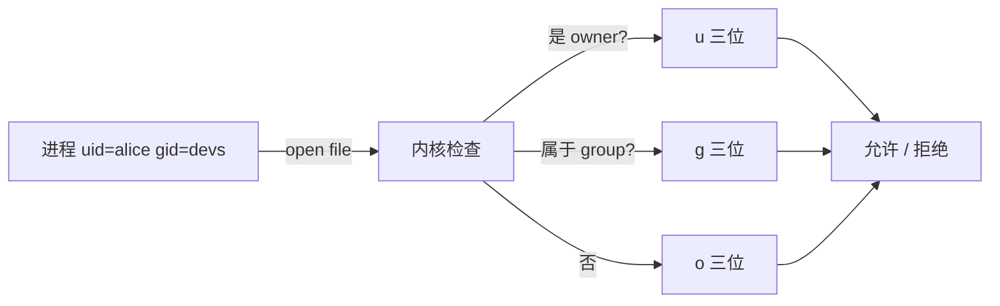

<KeyIdea>
**一句话**：每个文件 / 目录有一个**所有者**和**所属组**；分别给「**所有者 / 同组 / 其他**」三个对象配 r / w / x 权限，9 个 bit 决定一切。
</KeyIdea>

## 是什么

```
ls -l 输出：
-rwxr-xr-- 1 alice devs 42 Aug 1 12:34 run.sh
│└┬┘└┬┘└┬┘   └┬─┘ └┬─┘
│ │  │  │     │    └ 组
│ │  │  │     └ 所有者
│ │  │  └ other r 不可写不可执行
│ │  └ group r-x 可读可执行
│ └ user rwx 全权限
└ 文件类型 - / d / l / b / c
```

数字表示：r=4、w=2、x=1，`rwxr-xr--` = 754。

## 打个比方

<Analogy>
就像**写字楼门禁卡**：
- **u (user)** = 你自己；
- **g (group)** = 你部门；
- **o (other)** = 大楼里的任何人。

每张门有「能不能进 / 能不能改门 / 能不能开锁」三种权限。
</Analogy>

## 关键概念

<Terms items={[
  { term: "r / w / x", en: "读 / 写 / 执行", def: "目录的 r 是 ls 列表，x 是进入目录，w 是创建 / 删除内部文件。" },
  { term: "chmod", en: "改权限", def: "`chmod 755 file` 数字模式 / `chmod g+w file` 符号模式。" },
  { term: "chown", en: "改所有者", def: "`chown alice:devs file`。" },
  { term: "umask", en: "缺省权限掩码", def: "新建文件 / 目录的默认权限：完整权限 - umask。常见 022。" },
  { term: "SUID / SGID / Sticky", en: "特殊位", def: "SUID(4) 以所有者身份执行；SGID(2) 目录里新文件继承组；Sticky(1) /tmp 上只能删自己的。" },
  { term: "ACL", en: "扩展权限", def: "rwx 不够时用 `setfacl / getfacl` 给特定用户额外权限。" },
]} />

## 常用速查

```bash
chmod 755 script.sh        # rwxr-xr-x
chmod 644 README.md        # rw-r--r--
chmod -R u+w,g-w dir/      # 递归
chown -R deploy:web /var/www/site

# 让自己写 / 别人只读
umask 022

# /tmp 的 sticky bit（已默认）
chmod 1777 /tmp

# 给某个用户单独读权限（不动 group）
setfacl -m u:bob:r-- secret.txt
```

## 怎么工作



内核**只看进程的 uid / gid 和文件元数据**，跟登录名 / 路径没关系。

## 实操要点

- **生产环境忌 777**：基本等于「全世界都能改」。
- **目录 x 没有 = 进不去**：常见坑：`chmod -x dir` 之后 `cd` 报错。
- **文件 x 没有 = 不能直接执行**：但还能 `bash file` 运行（用 bash 解释器代你读）。
- **服务用户最小化**：跑服务用专门用户（`www-data` / `nginx`），不要 root。
- **看不到隐藏文件**：`ls -la` 显示 `.hidden`。
- **`stat file`** 看完整 metadata（uid / mtime / inode / 块大小）。

## 易混点

<Compare
  leftTitle="rwx 权限位"
  rightTitle="ACL"
  left={<>
    简单 9 位 + 三类对象。<br />
    覆盖 95% 场景。
  </>}
  right={<>
    任意用户 / 任意组细粒度。<br />
    复杂时用，否则别滥用。
  </>}
/>

## 延伸阅读

- [Linux 速通](/ops/beginner/linux-quickstart)
- [用户与组](/ops/beginner/user-group)
- [SSH](/ops/beginner/ssh)
