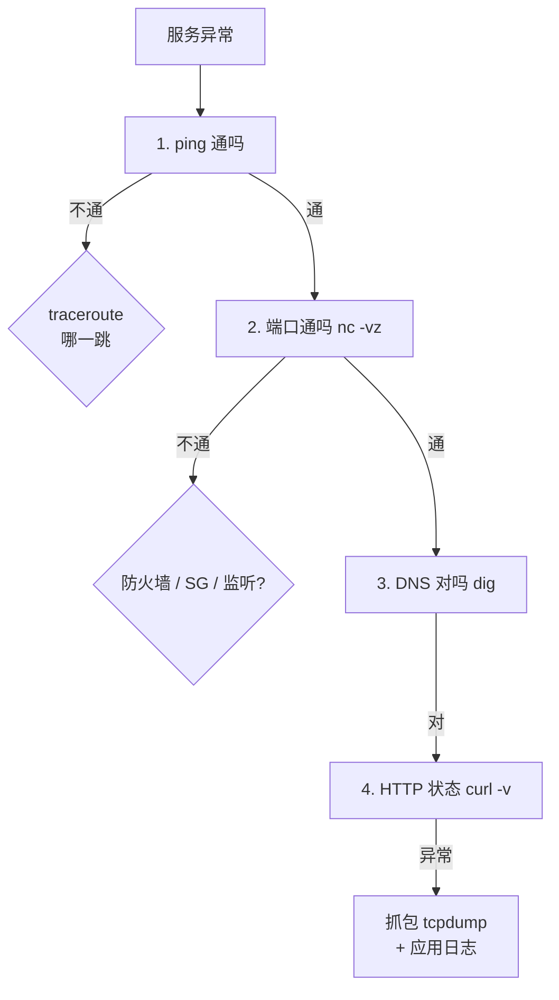

<KeyIdea>
**一句话**：服务器上排查网络问题最常用的就这几个命令。**`ip` 看接口、`ss` 看连接、`curl/dig` 测应用、`nc` 测端口、`tcpdump` 抓包**。背熟这套就能定位 95% 的故障。
</KeyIdea>

## 速查表

```bash
# 接口与路由
ip a                         # 看 IP 地址
ip r                         # 看路由表
ip neigh                     # 看 ARP / NDP 表

# 连接 / 端口
ss -tlnp                     # TCP 监听端口 + 进程
ss -tnp                      # 已建立的 TCP
ss -tnp '( dport = :443 )'   # 过滤
netstat -tlnp                # 老一辈写法（建议改 ss）

# DNS
dig www.example.com
dig +short www.example.com
dig @8.8.8.8 example.com mx
host example.com
nslookup example.com

# HTTP / 端口连通
curl -I https://example.com
curl -v https://example.com
curl --resolve example.com:443:1.2.3.4 https://example.com   # 强制 IP
nc -vz host 443                   # TCP 连通性
nc -u -vz host 53                 # UDP 探测（不一定准）
telnet host 443                   # 老牌 TCP 测试

# 抓包
tcpdump -i any -nn -s0 'host 1.2.3.4 and port 443'
tcpdump -i eth0 -w out.pcap 'tcp port 80'

# 防火墙
iptables -L -n -v
nft list ruleset
ufw status

# 路径
ping -c 5 1.1.1.1
mtr -wbz example.com
traceroute -T -p 443 example.com
```

## 打个比方

<Analogy>
这些命令像**外科医生的手术包**：每个工具看起来普通，但你要**知道什么时候掏哪一把**。
</Analogy>

## 关键概念

<Terms items={[
  { term: "ip", en: "iproute2 套件", def: "现代标准，替代 ifconfig / route。" },
  { term: "ss", en: "Socket Stat", def: "替代 netstat，快、信息全。" },
  { term: "curl", en: "URL 客户端", def: "几乎能模拟任何 HTTP / FTP 请求。-v 看完整往返。" },
  { term: "dig", en: "DNS 工具", def: "比 nslookup 更精确，结构化输出。" },
  { term: "nc", en: "Netcat", def: "瑞士军刀。能发任意 TCP/UDP，能监听端口。" },
  { term: "tcpdump", en: "命令行抓包", def: "带 BPF 过滤器，可写 pcap 给 Wireshark 看。" },
]} />

## 排障套路



按层定位 = 排障的核心思路。

## 实操要点

- **`curl -v` 是金标**：能看到 DNS、TCP 握手、TLS 握手、HTTP 头、响应 —— 一条命令模拟整个浏览器请求。
- **`ss -s`**：一行汇总当前 socket 数（监听 / 已连接 / TIME_WAIT 各多少）。
- **`tcpdump` 抓包技巧**：`-nn` 不解析 IP / 端口（更快），`-s0` 抓完整包，写 pcap 用 Wireshark 看。
- **常见误诊**：ping 不通 ≠ 服务不通（ICMP 被防火墙拦）；端口通 ≠ 服务正常（应用挂了 listener 还在）。
- **DNS 不缓存？**：本机用 `systemd-resolved` 或 `dnsmasq` 缓存，`resolvectl flush-caches` 清缓存。
- **服务连不到自己**：可能 `127.0.0.1` 监听 vs 远端来访问 `内网 IP`，绑定 0.0.0.0 才行。

## 易混点

<Compare
  leftTitle="netstat / ifconfig"
  rightTitle="ss / ip"
  left={<>
    老 net-tools，部分发行版默认不装。
  </>}
  right={<>
    iproute2 现代标准，**优先用这套**。
  </>}
/>

## 延伸阅读

- [ping](/network/beginner/ping) / [traceroute](/network/beginner/traceroute)
- [Wireshark](/network/ecosystem/wireshark)
- [SSH](/ops/beginner/ssh)
