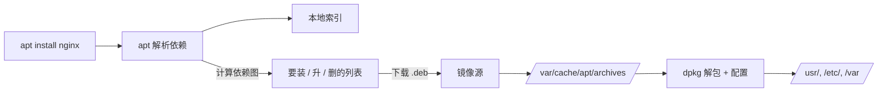

<KeyIdea>
**一句话**：包管理器是发行版的「**应用商店**」 —— 解决依赖、签名验证、统一升级、卸载留痕。**生产环境装软件先用包管理器**，源码编译是最后选项。
</KeyIdea>

## 主流包管理器

<KV items={[
  { k: "Debian / Ubuntu", v: "apt（高层）/ dpkg（底层）；包后缀 .deb" },
  { k: "RHEL / CentOS / Fedora / Rocky", v: "dnf（新）/ yum（旧）；包后缀 .rpm" },
  { k: "Alpine", v: "apk；轻量，常用于容器" },
  { k: "Arch", v: "pacman；滚动更新" },
  { k: "macOS", v: "brew（用户级）" },
  { k: "跨发行版", v: "snap / flatpak / appimage（沙箱）" },
  { k: "语言级", v: "pip / npm / cargo / gem / composer（不算系统包）" },
]} />

## 打个比方

<Analogy>
**包管理器** = **正规应用商店**：自动装依赖、验证签名、出问题一键卸载。  
**源码编译** = **自己拼乐高**：你能完全控制，但**升级 / 卸载 / 依赖**都得自己记账。
</Analogy>

## 常用命令对比

```bash
# Ubuntu / Debian
sudo apt update                  # 刷源
sudo apt install -y nginx        # 装
sudo apt upgrade                 # 升级所有包
sudo apt remove nginx            # 卸（保留配置）
sudo apt purge nginx             # 卸 + 删配置
apt list --installed | grep nginx
apt-cache search keyword
dpkg -L nginx                    # 列文件

# RHEL / Fedora
sudo dnf install -y nginx
sudo dnf update
sudo dnf remove nginx
rpm -qa | grep nginx
rpm -ql nginx

# Arch
sudo pacman -S nginx
sudo pacman -Syu                 # 同步 + 升级所有
yay -S aur-package               # AUR

# Alpine
apk add nginx
apk update && apk upgrade
```

## 关键概念

<Terms items={[
  { term: "源 / 仓库", en: "Repository", def: "/etc/apt/sources.list、/etc/yum.repos.d/。换镜像源大幅加速。" },
  { term: "依赖 / 反向依赖", en: "Depends / Reverse Depends", def: "包之间的依赖网。删一个常常牵连一片。" },
  { term: "签名", en: "GPG / RPM Signature", def: "源仓库公钥校验包没被篡改。第三方仓库要先导入 key。" },
  { term: "锁版本", en: "Pin / Hold", def: "apt-mark hold 把包锁在当前版本，防意外升级。" },
  { term: "PPA / COPR", en: "第三方源", def: "Ubuntu 的 PPA、Fedora 的 COPR，用户社区构建包。" },
  { term: "snap/flatpak", en: "沙箱包", def: "自带依赖、跨发行版，但磁盘占用大、启动慢。" },
]} />

## 怎么工作



## 实操要点

- **永远先 update 再 install**：`apt update && apt install`。
- **自动续期**：Debian/Ubuntu 装 `unattended-upgrades` 自动打安全补丁。
- **加第三方源**：导入 GPG key → 写 `/etc/apt/sources.list.d/xxx.list` → `apt update`。
- **服务器最小化**：装 server / minimal 镜像，**不要再装 desktop 套件**。
- **容器里**：alpine 用 apk、ubuntu/debian 用 apt，**装完清缓存**：`rm -rf /var/lib/apt/lists/*`，镜像更小。
- **不要 `pip install --user` 当系统包用**：CI / 多人环境会乱。Python 服务用 venv / pipx / uv。
- **想找哪个包提供某文件**：

  ```bash
  apt-file search /usr/bin/nginx        # Debian
  dnf provides /usr/bin/nginx           # RHEL
  ```

## 易混点

<Compare
  leftTitle="系统包管理"
  rightTitle="语言包管理"
  left={<>
    apt / dnf / brew。<br />
    管系统级二进制 + 库。
  </>}
  right={<>
    pip / npm / cargo。<br />
    管应用语言依赖，**装到项目而非系统**。
  </>}
/>

## 延伸阅读

- [Linux 速通](/ops/beginner/linux-quickstart)
- [systemd](/ops/beginner/systemd)
- [Docker](/ops/advanced/docker)
