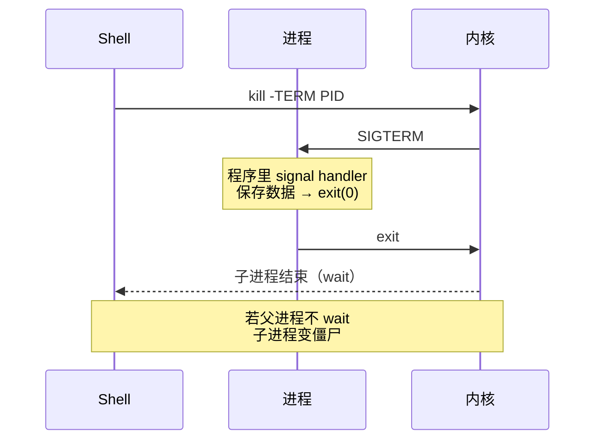

<KeyIdea>
**一句话**：Linux 上**一切运行中的程序都是进程**；进程间靠**信号**通信；`kill` 不是动词，是「**send signal**」。SIGTERM (15) 让进程自己优雅退；SIGKILL (9) 内核直接收尸。
</KeyIdea>

## 是什么

```
进程 = 一个程序的运行实例
       ↓
       PID（进程 ID）
       PPID（父进程 ID）
       UID / GID（身份）
       状态（R / S / D / Z / T）
```

每个进程都有一个父进程；init / systemd（PID 1）是所有进程的祖先。

## 打个比方

<Analogy>
进程像**正在演出的演员**。  
`SIGTERM` 像**下班铃声**：「请收尾下班」 —— 演员保存好东西再走。  
`SIGKILL` 像**直接拉电闸**：演出立刻黑屏，**未保存的全没**。  
僵尸进程像**演员已经走了但工资单没结**：父进程没去签字结清。
</Analogy>

## 关键概念

<Terms items={[
  { term: "PID", en: "进程 ID", def: "唯一编号。pid 1 是 init / systemd。" },
  { term: "状态", en: "ps STAT 列", def: "R 跑 / S 睡 / D 不可中断（IO 中）/ Z 僵尸 / T 暂停。" },
  { term: "信号", en: "Signal", def: "OS 给进程的异步通知。常用 1 HUP、2 INT、9 KILL、15 TERM。" },
  { term: "孤儿进程", en: "Orphan", def: "父进程死了，被 init/systemd 接管。无害。" },
  { term: "僵尸进程", en: "Zombie / defunct", def: "子进程已结束，但父进程没 wait 收尸。资源占用极小，但**多了说明父进程有 bug**。" },
  { term: "守护进程", en: "Daemon", def: "脱离终端长期运行的后台进程，传统上以 `d` 结尾（sshd / nginxd）。" },
]} />

## 怎么工作



`SIGKILL`（9）和 `SIGSTOP` 是**唯二无法被进程捕获 / 屏蔽**的信号。

## 实操要点

- **`ps aux | grep xxx`** 或 `pgrep -fa xxx` 找进程。
- **`top` / `htop` / `btop`**：实时查看 CPU / 内存。
- **优雅停服务永远先 `SIGTERM`**：默认 `kill PID` 就是 15。等几秒后再 `kill -9`。
- **直接 -9 的代价**：连接没关、缓冲数据丢、临时文件没清 —— 数据库尤其忌讳。
- **杀进程组**：`kill -- -PGID` 或 `pkill -P PID`，避免遗漏子进程。
- **`SIGHUP`（1）通常意为「重读配置」**：nginx / sshd 等约定如此。
- **僵尸不能再被 kill**：只能找到 PPID，让父进程退出（init 接管自动收尸）。
- **`strace -p PID`** 看进程在做什么系统调用，**调试卡死神器**。

## 易混点

<Compare
  leftTitle="kill (TERM)"
  rightTitle="kill -9 (KILL)"
  left={<>
    给进程**一个机会自我清理**。<br />
    可被 ignore（极少数）。
  </>}
  right={<>
    内核**强制**收尸。<br />
    不可阻挡，可能丢数据。
  </>}
/>

## 延伸阅读

- [Linux 速通](/ops/beginner/linux-quickstart)
- [systemd](/ops/beginner/systemd)
- [日志系统](/ops/beginner/log-system)
