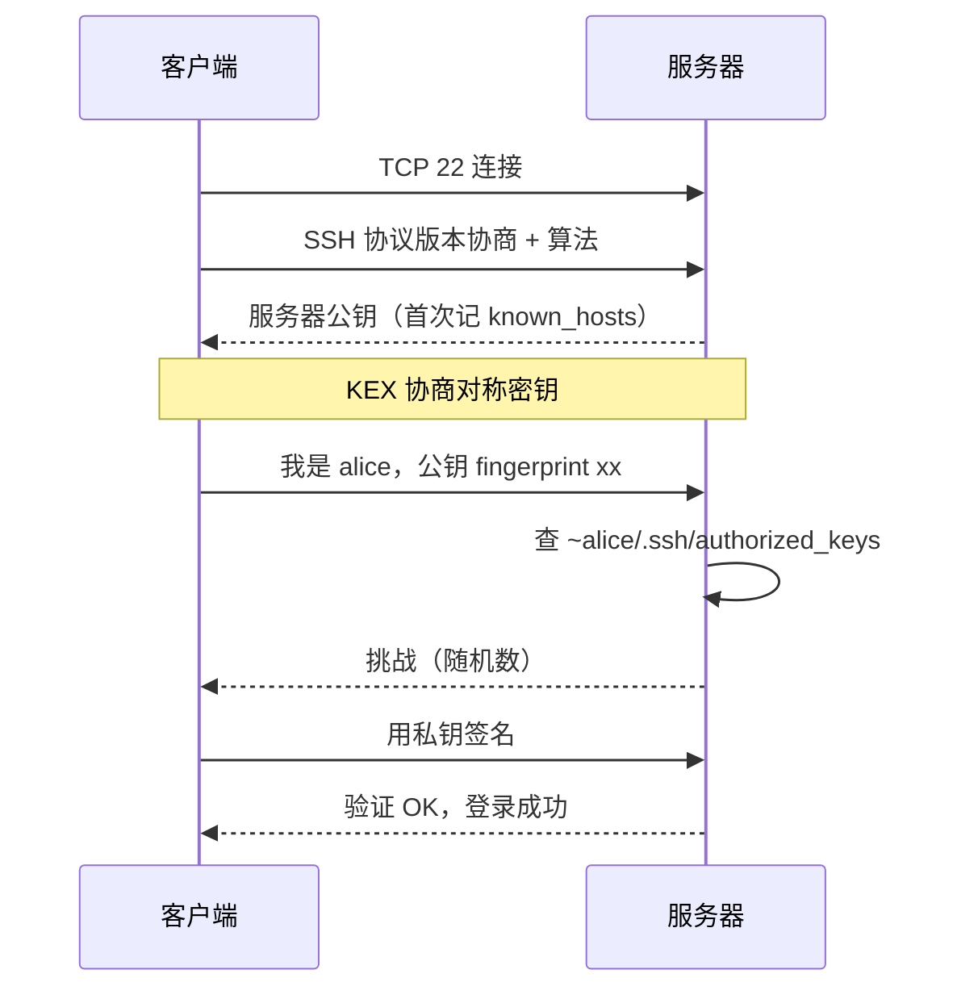

<KeyIdea>
**一句话**：SSH 是远程登录 + 远程执行 + 端口转发的瑞士军刀。**用密钥别用密码** + `~/.ssh/config` 集中管理 + 善用隧道，运维效率翻倍。
</KeyIdea>

## 是什么

最常见的三个用法：

```bash
# 登录
ssh user@host

# 远程执行命令
ssh host 'docker ps'

# 拷文件
scp file user@host:/path/
rsync -aP local/ user@host:remote/

# 端口转发
ssh -L 5432:db.internal:5432 user@bastion   # 本地 → 远端
ssh -R 8080:localhost:3000 user@public      # 远端反向到本地
```

## 打个比方

<Analogy>
SSH 像**加密的电话总机**：除了能接通你（登录），还能**接其它分机**（端口转发）、把你接到**对方的内部分机**（jump host），全程**加密 + 双向认证**。
</Analogy>

## 关键概念

<Terms items={[
  { term: "公钥认证", en: "Pubkey Auth", def: "客户端有私钥（id_ed25519）、服务器有公钥（authorized_keys），握手时签名验证。" },
  { term: "ssh-agent", en: "私钥代理", def: "本地常驻进程持私钥，免每次输 passphrase。" },
  { term: "ProxyJump", en: "跳板", def: "`ssh -J bastion target`，多级跳板也支持。" },
  { term: "ssh config", en: "~/.ssh/config", def: "把 Host / HostName / User / IdentityFile 写在配置文件里，命令行只敲别名。" },
  { term: "known_hosts", en: "服务器指纹", def: "首次连记录服务器公钥指纹，下次变了报警（防中间人）。" },
  { term: "Tunnel", en: "隧道转发", def: "-L 本地转发 / -R 反向转发 / -D SOCKS 代理。" },
]} />

## 推荐配置

`~/.ssh/config`：

```
Host bastion
    HostName 1.2.3.4
    User ops
    IdentityFile ~/.ssh/id_ed25519

Host db
    HostName 10.0.0.20
    User ops
    ProxyJump bastion
    ForwardAgent no

Host *
    ServerAliveInterval 30
    ServerAliveCountMax 3
    HashKnownHosts yes
```

之后只要 `ssh db` 就自动走跳板。

`/etc/ssh/sshd_config`（服务器加固）：

```
PermitRootLogin no
PasswordAuthentication no
PubkeyAuthentication yes
AllowUsers deploy ops
MaxAuthTries 3
```

## 怎么工作



之后所有操作（shell / scp / 转发）都在这条加密通道上**多路复用**。

## 实操要点

- **生成密钥**：`ssh-keygen -t ed25519`（比 RSA 短小且更安全）。
- **拷公钥到服务器**：`ssh-copy-id user@host`。
- **关掉密码登录**：`PasswordAuthentication no`，只允许密钥。
- **控制 master**：`ControlMaster auto` + `ControlPath` 让多次 ssh 共用一条连接，**速度快很多**。
- **SOCKS 代理**：`ssh -D 1080 host`，浏览器配 SOCKS5 → 实现「**就一条 ssh** = 翻墙」。
- **审计**：`/var/log/auth.log` 或 `journalctl -u sshd`。失败暴破多 → 加 fail2ban。
- **fish/zsh 用户记住**：sshd 用 `$SHELL` 不会自动读 `.profile`，环境变量记得写在 `.bashrc`/`.zshrc`。

## 易混点

<Compare
  leftTitle="密码登录"
  rightTitle="密钥登录"
  left={<>
    可被暴破。<br />
    新设备 / 临时用还行。
  </>}
  right={<>
    密码学级别强度。<br />
    生产标配。
  </>}
/>

## 延伸阅读

- [用户与组](/ops/beginner/user-group)
- [WireGuard / Tailscale](/network/ecosystem/wireguard-tailscale) —— SSH 之上的私有网络
- [TLS 握手细节](/network/advanced/tls-handshake) —— 类似的握手原理
