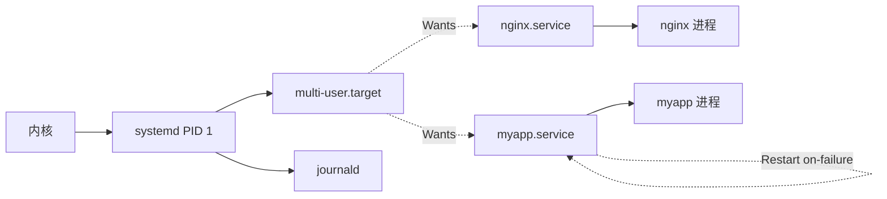

<KeyIdea>
**一句话**：systemd 是 Linux **PID 1 init**，统一管理服务、依赖、日志、定时器、cgroup 资源限制。**部署生产服务的标准方法**就是写一个 service unit。
</KeyIdea>

## 是什么

最小 service unit `/etc/systemd/system/myapp.service`：

```ini
[Unit]
Description=My App
After=network.target

[Service]
Type=simple
User=myapp
WorkingDirectory=/opt/myapp
ExecStart=/opt/myapp/bin/serve
Restart=on-failure
RestartSec=5
Environment="PORT=8080"
LimitNOFILE=65536

[Install]
WantedBy=multi-user.target
```

```bash
sudo systemctl daemon-reload
sudo systemctl enable --now myapp
journalctl -u myapp -f
```

## 打个比方

<Analogy>
systemd 像**写字楼物业**：决定哪个公司什么时候开门（启动顺序）、断电怎么恢复（自动重启）、谁能用多少电（cgroup）、保安记什么日志（journal）。
</Analogy>

## 关键概念

<Terms items={[
  { term: "Unit", en: "单元", def: "service / socket / timer / mount / target 等。一切皆 unit。" },
  { term: "Target", en: "目标", def: "类似 runlevel 的状态集合，multi-user.target 是常态。" },
  { term: "依赖", en: "Wants/Requires/After", def: "Wants 弱依赖、Requires 强依赖、After 顺序。" },
  { term: "Restart 策略", en: "Restart", def: "no/always/on-failure/on-abnormal。生产用 on-failure + RestartSec。" },
  { term: "Type", en: "服务类型", def: "simple（前台）/ forking（fork 后退出）/ notify（自报告就绪）/ oneshot（跑完即可）。" },
  { term: "Drop-in", en: "/etc/systemd/system/<unit>.d/override.conf", def: "覆盖部分字段而不动原 unit。" },
  { term: "Timer", en: "定时器", def: "替代 cron，更灵活更可观测。" },
]} />

## 常用命令

```bash
systemctl status nginx
systemctl start / stop / restart / reload nginx
systemctl enable --now nginx        # 开机自启 + 立刻启
systemctl disable --now nginx
systemctl daemon-reload             # unit 文件改了之后必跑
systemctl list-units --type=service
systemctl edit nginx                # 创建 drop-in override
journalctl -u nginx -f
systemd-analyze blame               # 谁拖慢了开机
```

## 怎么工作



systemd 用 **cgroup** 跟踪每个 service 的所有子进程 —— 进程 fork 也跑不掉。

## 实操要点

- **生产服务必加**：`Restart=on-failure` + `RestartSec=` + `LimitNOFILE` + 专属 `User=`。
- **安全沙箱字段值得用**：`ProtectSystem=strict`、`ProtectHome=true`、`PrivateTmp=true`、`NoNewPrivileges=true`、`CapabilityBoundingSet=` —— **零成本**降低被打穿后的横向风险。
- **资源限制**：`MemoryMax=2G`、`CPUQuota=50%` —— 比 ulimit 更现代。
- **timer 替代 cron**：

  ```ini
  # /etc/systemd/system/backup.timer
  [Timer]
  OnCalendar=*-*-* 03:00:00
  Persistent=true
  [Install]
  WantedBy=timers.target
  ```

- **`systemd-cgtop`**：top 风格看每个 service 的实际资源占用。
- **socket 激活**：监听端口 → 来连接才拉起服务，省内存。

## 易混点

<Compare
  leftTitle="systemd"
  rightTitle="SysV init / 自己 nohup"
  left={<>
    自动重启 + 日志 + cgroup + 依赖。<br />
    生产标准。
  </>}
  right={<>
    一段 sh 脚本启动。<br />
    崩了不重启、日志散乱、不可观测。
  </>}
/>

## 延伸阅读

- [日志系统](/ops/beginner/log-system)
- [cron](/ops/beginner/cron)
- [Docker](/ops/advanced/docker) —— 容器内通常不跑 systemd
