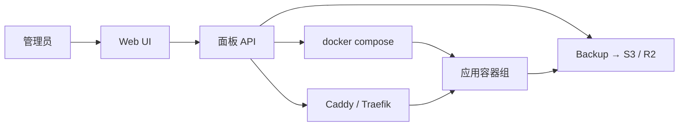

<KeyIdea>
**一句话**：这类工具把 **Docker / Compose / Caddy / 数据库 / 备份** 包装成 Web UI，让你在一台 VPS 上点几下就能部署应用、申请 HTTPS、监控资源 —— **个人 / 小团队不用上 K8s**也能很专业。
</KeyIdea>

## 主流自托管面板

<KV items={[
  { k: "1Panel", v: "国内活跃；Linux 服务器管理 + Docker 应用商店 + WAF + 备份。中文友好。" },
  { k: "Coolify", v: "开源 Heroku/Vercel 替代品。Git push 即部署、自动 HTTPS、数据库托管。" },
  { k: "Dokploy", v: "类似 Coolify，UI 简洁、模板丰富。" },
  { k: "Portainer", v: "老牌 Docker / K8s 管理面板，偏运维侧。" },
  { k: "CasaOS / Yunohost / Cosmos Cloud", v: "家庭服务器 / NAS 风格，应用商店为主。" },
]} />

## 打个比方

<Analogy>
直接 ssh + docker compose = **裸金属**；  
Vercel / Render = **托管 SaaS**；  
1Panel / Coolify = **自家 Vercel** —— 你用别人的 UI 体验，但**主权 100% 在自己手里**（数据 / 域名 / 价格）。
</Analogy>

## 共同特性

<Terms items={[
  { term: "应用模板", en: "App Templates", def: "一键部署 WordPress / GitLab / Plausible / Umami 等常见软件。" },
  { term: "Git 部署", en: "Git Deploy", def: "Coolify 类支持 Dockerfile / Nixpacks / Buildpack 自动识别构建。" },
  { term: "自动 HTTPS", en: "Auto HTTPS", def: "内嵌 Caddy / Traefik，配域名 → 自动 Let's Encrypt。" },
  { term: "备份", en: "Backups", def: "数据库 / 配置定时备份到 S3 / R2。" },
  { term: "资源面板", en: "Dashboard", def: "CPU / 内存 / 磁盘实时图。" },
  { term: "网关 / 反代", en: "Built-in Proxy", def: "面板内置反向代理，按域名分发到容器。" },
]} />

## 怎么工作

底层都是 Docker / Compose；面板帮你**生成 + 维护 yaml**。

## 实操要点

- **小项目 + 单 / 双 VPS** 这类面板效率最高；**> 5 台或多团队**还是上 K8s + Argo CD。
- **数据持久化**：装的时候选好挂载路径，备份走面板内置 + S3 / R2 异地。
- **域名解析**：先把域名 A / AAAA 指 VPS，再在面板加域名 → 自动签证书。
- **监控告警**：1Panel 内置警报，Coolify 集成 Healthchecks.io / 飞书 Webhook。
- **更新机制**：面板自身一定要定期升级（包含安全补丁），平台 API 才稳定。
- **开放端口**：80 / 443 必须开；建议 22 改端口或用 Tailscale 不暴露 SSH。
- **API + CLI**：Coolify 有 API，能配合 GitHub Actions 自动部署。

## 易混点

<Compare
  leftTitle="1Panel / Coolify"
  rightTitle="K8s + Argo CD"
  left={<>
    单 / 几台 VPS，**点点点**。 
    上手 5 分钟。
  </>}
  right={<>
    多机 / 多环境 / 团队规模化。 
    上手数周。
  </>}
/>

## 延伸阅读

- [Docker Compose](/ops/advanced/docker-compose)
- [Caddy](/network/ecosystem/caddy)
- [备份与恢复](/ops/advanced/backup-restore)
