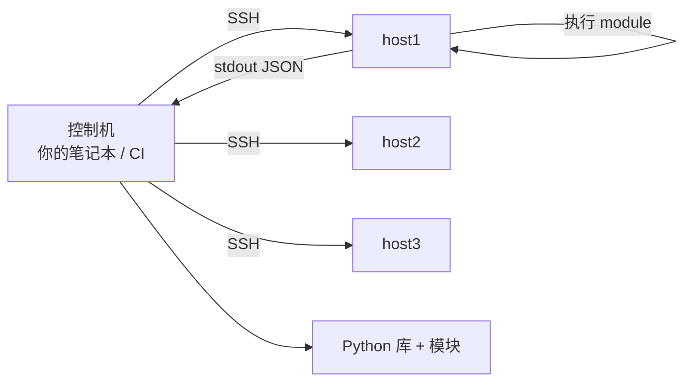

<KeyIdea>
**一句话**：Ansible 通过 SSH 把任务推到目标机器执行，**不需要安装任何 agent**。声明式、幂等、可重复 —— 配几十上百台机器最顺手的工具。
</KeyIdea>

## 是什么

`inventory.ini`：

```ini
[web]
web1 ansible_host=10.0.0.11
web2 ansible_host=10.0.0.12

[db]
db1 ansible_host=10.0.0.20

[all:vars]
ansible_user=ops
```

`site.yml`：

```yaml
- hosts: web
  become: true
  tasks:
    - name: 装 nginx
      apt: { name: nginx, state: present, update_cache: true }
    - name: 配 nginx
      template:
        src: nginx.conf.j2
        dest: /etc/nginx/nginx.conf
      notify: reload nginx
    - name: 启服务
      service: { name: nginx, state: started, enabled: true }

  handlers:
    - name: reload nginx
      service: { name: nginx, state: reloaded }
```

```bash
ansible-playbook -i inventory.ini site.yml
ansible-playbook -i inventory.ini site.yml --check        # dry-run
ansible web -i inventory.ini -m shell -a 'uptime'         # 临时一条
```

## 打个比方

<Analogy>
SSH 一台台敲 = **一封封手写信**；  
shell 脚本广播 = **群发一样的信，但写错就一起错**；  
Ansible = **总部下发一份带变量和确认机制的工单**：**做了的不重做、做完打勾、失败可记录可重试**。
</Analogy>

## 关键概念

<Terms items={[
  { term: "Inventory", en: "主机清单", def: "静态 ini/yaml 或动态（云 API、Tailscale、AWX）。" },
  { term: "Module", en: "模块", def: "Ansible 真正干活的脚本（apt / file / template / service），都内置幂等。" },
  { term: "Playbook", en: "剧本", def: "一组 plays，play 指明 hosts + tasks。" },
  { term: "Role", en: "角色", def: "可复用的一组 tasks/templates/files，目录结构标准化。" },
  { term: "Handler", en: "处理器", def: "条件触发的 task —— 配置改了才 reload。" },
  { term: "Vault", en: "ansible-vault", def: "加密敏感变量。CI 拿到密码才能解。" },
  { term: "AWX / Tower", en: "图形管理", def: "Web UI + RBAC + 任务计划，企业级使用。" },
]} />

## 怎么工作



控制机把 module 的 Python 代码 push 过去执行，**目标机只要有 Python 就够**。

## 实操要点

- **幂等是底线**：自己写 shell 必加 `creates:` / `removes:` 判断；优先用模块（apt / file / template）。
- **template + Jinja2**：配置文件按变量渲染。结合 group_vars / host_vars 分级覆盖。
- **角色化**：把"装 nginx + 配 + 启"打包成 role，可被多个 playbook 引用。
- **`--check` + `--diff`**：dry run 看会改什么。
- **回滚**：Ansible 不带版本快照；要用 git 管 playbook + 必要时改回旧值再 apply。
- **不要把 Ansible 当 SSH for-loop**：用模块 + 幂等，**胜过自写 shell 循环**。
- **大规模**：1000+ 台用 mitogen / SSH 多路复用 / fact cache 加速；或上 AWX 调度。
- **机密**：vault 加密 + CI 注入解密密码，禁止明文 commit。

## 易混点

<Compare
  leftTitle="Ansible"
  rightTitle="Chef / Puppet / Salt"
  left={<>
    Push（SSH）+ Agentless。<br />
    目标机零依赖（Python）。
  </>}
  right={<>
    Pull + Agent 常驻。<br />
    适合数千节点持续状态收敛。
  </>}
/>

## 延伸阅读

- [Terraform / OpenTofu](/ops/ecosystem/terraform-opentofu) —— 管云资源
- [Linux 速通](/ops/beginner/linux-quickstart)
- [SSH](/ops/beginner/ssh)
