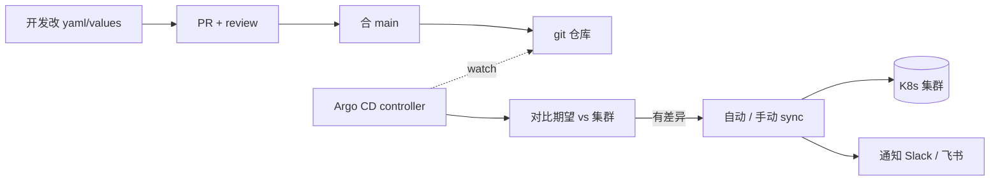

<KeyIdea>
**一句话**：Argo CD 监听 git 仓库里的 K8s manifest（裸 yaml / Helm / Kustomize），**持续同步到集群**。git push 即部署，集群手改的会被检测到 / 自动恢复 —— **声明式 GitOps** 范式。
</KeyIdea>

## 是什么

```yaml
# Application 自身也是一份 yaml
apiVersion: argoproj.io/v1alpha1
kind: Application
metadata:
  name: web
  namespace: argocd
spec:
  project: default
  source:
    repoURL: https://github.com/me/infra
    path: apps/web
    targetRevision: main
    helm:
      valueFiles: [values-prod.yaml]
  destination:
    server: https://kubernetes.default.svc
    namespace: prod
  syncPolicy:
    automated: { prune: true, selfHeal: true }
    syncOptions: ["CreateNamespace=true"]
```

之后 git push 改 values → Argo CD 几秒内同步到集群。

## 打个比方

<Analogy>
没有 Argo CD = 部署像**带锤子上集群**：人工敲 kubectl，手感全凭运气。  
有 Argo CD = **集群自带搬运机器人**，盯着 git 仓库，仓库一变就**整理出和仓库一致的状态**。
</Analogy>

## 关键概念

<Terms items={[
  { term: "Application", en: "应用", def: "一组 K8s 资源 + 来源 git 路径 + 目标集群命名空间。" },
  { term: "AppProject", en: "项目", def: "一组应用 + RBAC + 允许的源仓 / 目标集群限制。" },
  { term: "Sync Policy", en: "同步策略", def: "manual / automated；automated 又分 prune（删除不在 git 的资源）和 selfHeal（手改自动恢复）。" },
  { term: "Drift", en: "漂移", def: "集群与 git 不一致。Argo 用 OutOfSync 标识。" },
  { term: "Hook", en: "同步钩子", def: "PreSync / PostSync / SyncFail —— 用于跑迁移、通知等。" },
  { term: "ApplicationSet", en: "动态生成应用", def: "用 Generators（Git / List / Cluster）一次声明出多套 Application。" },
  { term: "Argo Rollouts", en: "渐进式发布", def: "扩展项目，支持 Canary / 蓝绿 / 流量切换 —— 替代 Deployment。" },
]} />

## 工作流



## 实操要点

- **GitOps 黄金法则**：**集群是只读的**。所有改动都从 git 进 → CI 校验 → ArgoCD apply。
- **结构推荐**：一个仓库管 platform（CRD / 集群级），另一个仓管 apps；或 monorepo 用目录隔离。
- **Helm + Kustomize 都支持**：复杂场景 helmfile / `helm-include` / `kustomize` 选你顺手的。
- **App of Apps**：一个 Application 引用 N 个 Application，根 yaml 引导整个集群。
- **多集群**：一个 ArgoCD 管多个目标集群（destination.server 不同 secret）。
- **审批 / 上线门**：用 ApplicationSet + sync windows 限定生产部署时间。
- **机密**：sealed-secrets / external-secrets / SOPS —— git 里只放密文。
- **回滚**：`argocd app rollback web` 或直接 git revert。

## 易混点

<Compare
  leftTitle="Argo CD（GitOps）"
  rightTitle="GitHub Actions deploy 步骤"
  left={<>
    集群拉，**永远以 git 为准**。<br />
    自动检测漂移、自愈。
  </>}
  right={<>
    流水线 push，**事件驱动**。<br />
    一次性，没了状态守恒概念。
  </>}
/>

## 延伸阅读

- [CI/CD 流水线](/ops/advanced/cicd-pipeline)
- [Helm](/ops/advanced/helm)
- [Kubernetes 核心概念](/ops/advanced/k8s-core)
