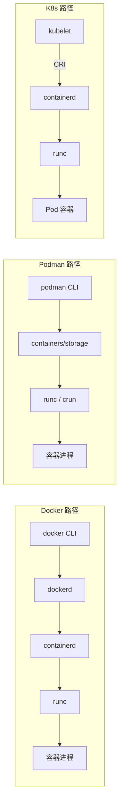

<KeyIdea>
**一句话**：**Docker** 是大众入门标准；**containerd** 是底层运行时（K8s 默认就是它）；**Podman** 是无 daemon、与 Docker CLI 兼容的替代品，**rootless 友好**。三者用 OCI 标准互相兼容。
</KeyIdea>

## 是什么

```
你执行的命令          实际背后跑的
docker run …  →  dockerd → containerd → runc → 容器进程
podman run …  →  podman →           containers/runc → 容器进程  (无 daemon)
crictl run …  →  containerd / CRI-O → runc                    (K8s 用)
```

**runc** 是真正调内核 namespace + cgroup 启动容器的小工具，所有上层都依赖它。

## 打个比方

<Analogy>
**runc** 是**砌砖工**；  
**containerd** 是**包工头**：管砖工干活、调度、计时；  
**Docker / Podman** 是**项目经理 + 客户接待**：你在 CLI 下单，他们安排。
</Analogy>

## 三者对比

<KV items={[
  { k: "Docker Desktop / dockerd", v: "需要后台守护进程；个人电脑 + 入门最简单。" },
  { k: "Podman", v: "无 daemon，单条命令直接 fork 出容器。`alias docker=podman` 能直接替换。原生支持 rootless。" },
  { k: "containerd", v: "现代 K8s（CRI-O 也是）默认运行时。日常用 `crictl` / `nerdctl`。" },
  { k: "K8s 视角", v: "K8s 早期通过 dockershim 调 docker，1.24+ 移除，原生用 containerd / CRI-O。" },
]} />

## 怎么工作



## 实操要点

- **CLI 兼容**：Podman 几乎 100% 兼容 docker 子命令 —— 直接替换，脚本不用改。
- **Rootless 默认**：Podman / 现代 Docker（rootless mode）都能让普通用户跑容器，更安全。
- **Pod 概念**：Podman 原生有 `podman pod`，多个容器共享网络，**和 K8s Pod 概念一致**，本地能直接 `podman generate kube` 导出 yaml。
- **K8s 不用 dockershim 了**：从 1.24 起原生跑 containerd / CRI-O，**镜像格式没变**（OCI 标准），构建产物兼容。
- **生产单机选谁**：单机长期跑选 Podman + systemd quadlet，比 docker 守护进程更"systemd-native"。
- **企业 / 信通**：很多场景对 daemon root 有审计要求，Podman 比 Docker 更易过审。

## 易混点

<Compare
  leftTitle="Docker"
  rightTitle="Podman"
  left={<>
    后台 dockerd 守护，root 权限。<br />
    生态最成熟。
  </>}
  right={<>
    无 daemon，rootless 默认。<br />
    CLI 兼容、Pod 概念一致。
  </>}
/>

## 延伸阅读

- [Docker 容器入门](/ops/advanced/docker)
- [Kubernetes 核心概念](/ops/advanced/k8s-core)
- [k3s / 轻量 K8s 发行版](/ops/ecosystem/k3s-distros)
