<KeyIdea>
**一句话**：GitHub Actions 把 CI/CD 直接绑在仓库事件上，**push / PR / tag / schedule** 都能触发。yml 写在 `.github/workflows/`，**公开仓库免费用、私仓有月度免费额度**。生态 marketplace 全。
</KeyIdea>

## 一份典型 workflow

```yaml
# .github/workflows/ci.yml
name: CI
on:
  push: { branches: [main] }
  pull_request:
permissions:
  contents: read
  packages: write
concurrency:
  group: ${{ github.workflow }}-${{ github.ref }}
  cancel-in-progress: true

jobs:
  test:
    runs-on: ubuntu-latest
    steps:
      - uses: actions/checkout@v4
      - uses: pnpm/action-setup@v3
      - uses: actions/setup-node@v4
        with: { node-version: 20, cache: pnpm }
      - run: pnpm install --frozen-lockfile
      - run: pnpm lint && pnpm typecheck && pnpm test
  build-image:
    needs: test
    if: github.ref == 'refs/heads/main'
    runs-on: ubuntu-latest
    steps:
      - uses: actions/checkout@v4
      - uses: docker/login-action@v3
        with:
          registry: ghcr.io
          username: ${{ github.actor }}
          password: ${{ secrets.GITHUB_TOKEN }}
      - uses: docker/build-push-action@v6
        with:
          push: true
          tags: ghcr.io/${{ github.repository }}:${{ github.sha }}
```

## 打个比方

<Analogy>
GitHub Actions 像**Git 仓库的肌肉**：你提交一行代码，它**自动派一群机器人**做全套质检 + 打包 + 部署。
</Analogy>

## 关键概念

<Terms items={[
  { term: "Workflow", en: "流水线", def: ".github/workflows/*.yml 一个文件一条。" },
  { term: "Job", en: "作业", def: "一组 steps，跑在一台 runner 上。多个 job 默认并行。" },
  { term: "Step", en: "步骤", def: "命令 / Action。Action 是社区可复用的封装（uses:）。" },
  { term: "Runner", en: "执行机", def: "github 托管（ubuntu-latest）或自托管（self-hosted runner）。" },
  { term: "Secret / Variable", en: "机密 / 变量", def: "仓库 / 组织 / 环境级，注入到 ${{ secrets.X }}。" },
  { term: "Environment", en: "环境", def: "可加保护规则（required reviewers / wait timer），prod 部署的常用守卫。" },
  { term: "Reusable / composite Action", en: "复用", def: "把通用步骤抽成可被多个 workflow 调用。" },
]} />

## 工作流

```mermaid
flowchart LR
    Event[push / PR / tag / cron] --> Trigger[GitHub 触发]
    Trigger --> Q[排队]
    Q --> Runner[Runner ubuntu-latest]
    Runner --> Step1[checkout]
    Step1 --> Step2[setup-node + cache]
    Step2 --> Step3[lint / test / build]
    Step3 --> Art[artifact / image push]
    Art --> Env[环境保护规则]
    Env -->|approve| Deploy[部署]
```



## 实操要点

- **`concurrency` 组合写**：同一分支后续 push 自动取消上次跑了一半的 workflow，省时间省钱。
- **缓存依赖**：`actions/setup-node@v4` 自带 `cache: pnpm/npm/yarn`；其它语言用 `actions/cache`。
- **OIDC 部署到云**：替代长期密钥。AWS / GCP / Azure 都能配 OIDC trust，**workflow 临时换出短期凭证**。
- **`permissions:` 收紧**：默认越来越窄，按 job 显式声明只给最小权限。
- **`pull_request_target` 慎用**：能拿到 secrets 但跑 fork 代码 = 安全炸点。
- **矩阵构建**：`strategy.matrix` 一次跑多 OS / 多版本。
- **分级环境保护**：`environments/prod` 里加审批人、wait timer、必需 reviewer。
- **自托管 runner**：跑大型 / 私有依赖；记得**不要给公网 PR 仓库配自托管 runner**（代码注入）。

## 易混点

<Compare
  leftTitle="GitHub Actions"
  rightTitle="GitLab CI / CircleCI / Drone"
  left={<>
    深度集成 GitHub。<br />
    免费额度大，公仓全免费。
  </>}
  right={<>
    GitLab 自家 / 跨平台 SaaS / 自托管。<br />
    各自生态 / 价格不同。
  </>}
/>

## 延伸阅读

- [CI/CD 流水线](/ops/advanced/cicd-pipeline)
- [Argo CD](/ops/ecosystem/argocd)
- [Dockerfile](/ops/advanced/dockerfile)
