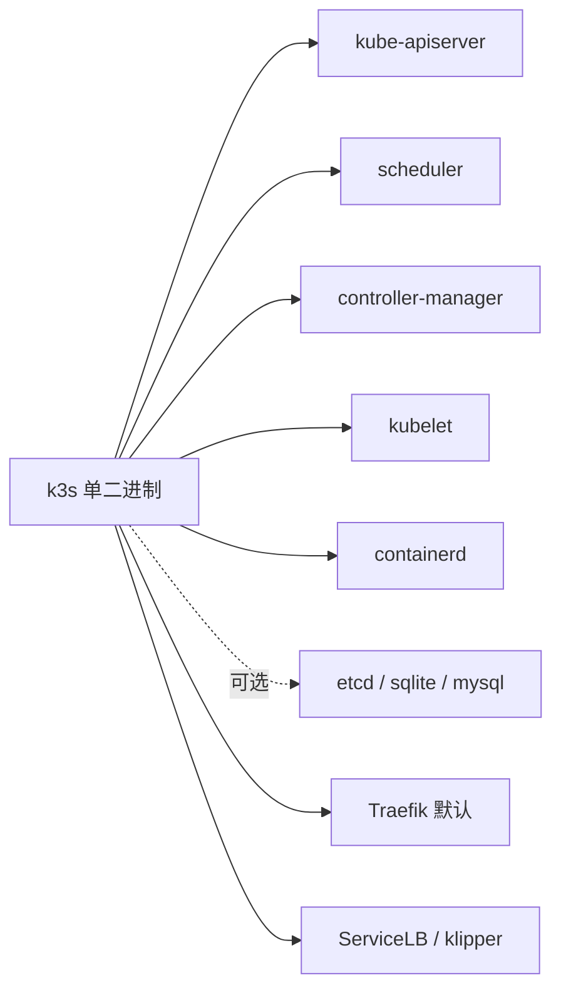

<KeyIdea>
**一句话**：原版 K8s 重得像航空母舰；**k3s** 把控制平面打包成单二进制，**100MB + 一行命令** 就装好。**家庭实验室 / 边缘 / IoT / 单机生产** 它都能扛。
</KeyIdea>

## 一行装 k3s

```bash
# Master
curl -sfL https://get.k3s.io | sh -

# 自动写好 kubeconfig
sudo cat /etc/rancher/k3s/k3s.yaml

# 加 Worker（拿 master 的 token）
curl -sfL https://get.k3s.io | K3S_URL=https://master:6443 \
  K3S_TOKEN=xxx sh -
```

之后 `kubectl get nodes` 就能用 —— **etcd / control plane / kubelet 全在一个二进制里**。

## 打个比方

<Analogy>
原版 K8s 像**完整的 IT 部门**：架构师、DBA、SRE、网络工程师 —— 大公司适合。  
k3s 像**全栈工程师**：一个人把活都干了，**小团队 / 个人 / 边缘**反而更利索。
</Analogy>

## 主流轻量发行版

<KV items={[
  { k: "k3s（Rancher / SUSE）", v: "单二进制 + sqlite/etcd 可选 + Traefik / Servicelb 默认。最流行。" },
  { k: "k0s", v: "更\"零依赖\"理念，主控用 etcd 或 kine。" },
  { k: "MicroK8s（Canonical）", v: "snap 安装，Ubuntu 自家。" },
  { k: "minikube / kind", v: "本地开发用；不适合生产。" },
  { k: "Talos Linux", v: "把 K8s 当成\"裸金属上的唯一应用\"，整机即不可变 OS。" },
  { k: "RKE2 / OKE / GKE Autopilot", v: "企业 / 云厂商托管。" },
]} />

## 怎么工作



## 实操要点

- **k3s 默认带很多电池**：Traefik / metrics-server / local-path / ServiceLB —— 单机即用。不想要可以 `--disable=traefik`。
- **轻量但是真 K8s**：API 兼容，Helm / kubectl / CRD / Operator 全都能用。
- **数据库**：节点数小于 30 用嵌入式 etcd 就行；更多节点选外部 etcd / mysql / postgres。
- **HA**：`--cluster-init` + 多 server 节点（≥3）做 control plane HA。
- **边缘场景**：Cattle Drive / Rancher Fleet 把数百集群按 GitOps 管。
- **家庭实验室**：3 台树莓派 + k3s + Tailscale = 100% 真实生产体验。
- **更新**：`curl get.k3s.io | sh -s - --version v1.30.x` 或 system-upgrade-controller。

## 易混点

<Compare
  leftTitle="k3s"
  rightTitle="原版 K8s (kubeadm)"
  left={<>
    单二进制，省内存。<br />
    生产 / 边缘 / 个人都行。
  </>}
  right={<>
    完整组件，灵活但复杂。<br />
    大集群 / 企业。
  </>}
/>

## 延伸阅读

- [Kubernetes 核心概念](/ops/advanced/k8s-core)
- [Helm](/ops/advanced/helm)
- [Argo CD](/ops/ecosystem/argocd)
