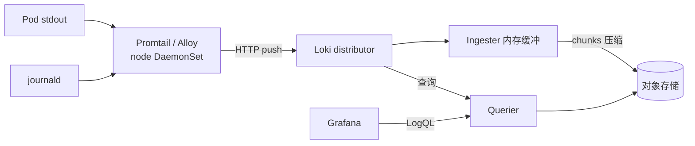

<KeyIdea>
**一句话**：Loki 把**标签做索引、日志正文不索引**，存对象存储 → 比 ES 便宜十倍。配 Promtail / Vector / Alloy 采集，配 Grafana 用 LogQL 查，**和 Prometheus 完美呼应**。
</KeyIdea>

## 是什么

```bash
helm install loki grafana/loki-stack \
  -n monitoring --set grafana.enabled=false \
  --set promtail.enabled=true
```

LogQL 长得像 PromQL：

```logql
{namespace="prod", app="web"} |= "error"
{app="web"} | json | status >= 500
sum(rate({app="web"} |~ "panic" [5m])) by (pod)
```

## 打个比方

<Analogy>
ES = **图书馆给每本书每个词都建卡片** —— 强大、贵；  
Loki = **只贴书脊标签**（架号 / 作者），找书先按标签锁货架，**再翻一两本** —— 省 80% 钱，**够 90% 场景**。
</Analogy>

## 关键概念

<Terms items={[
  { term: "Stream", en: "日志流", def: "由一组 label 唯一标识的一条日志流（namespace+app+pod+...）。" },
  { term: "Label vs Filter", en: "索引 vs 过滤", def: "Label 进索引（控制流数量）；正文用 |= / |~ / json 过滤（不进索引）。" },
  { term: "Chunks", en: "存储块", def: "Loki 把日志切块压缩存到对象存储（S3 / GCS / R2 / MinIO）。" },
  { term: "BoltDB-shipper / TSDB", en: "索引方式", def: "Loki 自己维护轻量索引上传到对象存储。" },
  { term: "Promtail / Alloy / Vector", en: "采集 agent", def: "在每节点跑，发送日志到 Loki。Alloy 是新一代统一 agent。" },
  { term: "Multi-tenant", en: "多租户", def: "X-Scope-OrgID 头隔离不同租户的数据。" },
]} />

## 怎么工作



读路径走 querier 拉块解压扫；**短查询快、长跨度查询慢但便宜**。

## 实操要点

- **不要乱加 label**：每多一个值组合就多一条 stream。**pod_id / request_id 这种高基数禁止做 label**，放正文用 `| json` 解析后过滤。
- **JSON 日志事半功倍**：`{app="web"} | json | duration_ms > 500`，零正则。
- **保留期分层**：7-14 天热（block storage 也行），90 天冷（仅对象存储）。
- **告警**：LogQL 也能写规则（ruler），错误日志数突增 → Alertmanager 通知。
- **替代 / 补充 ELK**：很多团队 ES 留给业务搜索，**运维日志全转 Loki** 省成本。
- **多集群**：每集群 Promtail → 中心 Loki / Mimir 风格分布式 Loki。
- **大体量** 用 [bloom-shipper](https://grafana.com/docs/loki/latest/operations/storage/) 加速正文检索。

## 易混点

<Compare
  leftTitle="Loki"
  rightTitle="Elasticsearch / OpenSearch"
  left={<>
    标签索引 + 对象存储。<br />
    便宜、和 Prometheus 同心智模型。
  </>}
  right={<>
    全文倒排索引。<br />
    强搜索 / 复杂聚合，**贵**。
  </>}
/>

## 延伸阅读

- [日志聚合](/ops/advanced/log-aggregation)
- [Prometheus + Grafana](/ops/ecosystem/prometheus-grafana)
- [日志系统（journalctl）](/ops/beginner/log-system)
