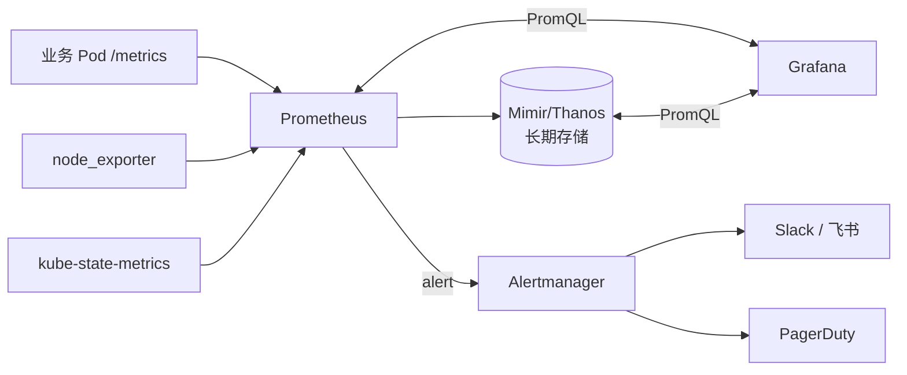

<KeyIdea>
**一句话**：Prometheus 抓指标、TSDB 存、Alertmanager 告警；Grafana 展示。**kube-prometheus-stack** Helm Chart 一键装齐，包含 node-exporter / kube-state-metrics / cAdvisor，覆盖主机 + K8s + 应用。
</KeyIdea>

## 是什么

```bash
helm repo add prometheus-community https://prometheus-community.github.io/helm-charts
helm install monitoring prometheus-community/kube-prometheus-stack \
  -n monitoring --create-namespace
```

装完得到：

- **Prometheus**：指标 TSDB
- **Alertmanager**：告警分组 / 静默 / 通知
- **node-exporter**：主机 CPU / 内存 / 磁盘 / 网络
- **kube-state-metrics**：K8s 对象状态
- **Grafana**：可视化 + 预置仪表板

## 打个比方

<Analogy>
**Prometheus** 是**收集 + 算账**的会计；  
**Grafana** 是**展板** —— 把账本变成图表挂墙上；  
**Alertmanager** 是**前台秘书**：账目不对就给你打电话 / 发微信 / 飞书。
</Analogy>

## 关键概念

<Terms items={[
  { term: "ServiceMonitor / PodMonitor", en: "声明抓取目标", def: "Operator CRD：把『抓哪些 Pod / Svc 的 /metrics』描述成 K8s 对象。" },
  { term: "Recording Rule", en: "预聚合规则", def: "把昂贵 PromQL 的结果**周期性算好存成新指标**，仪表板加载快。" },
  { term: "Alert Rule", en: "告警规则", def: "PromQL 返回非空 + for: 5m → 触发。" },
  { term: "Dashboard", en: "仪表板", def: "Grafana JSON。可从 grafana.com 找官方 / 社区现成的导入。" },
  { term: "Datasource", en: "数据源", def: "Prometheus / Loki / Tempo / MySQL —— Grafana 是统一观测面板。" },
  { term: "Long-term Storage", en: "长期存储", def: "Prometheus 默认 15 天本地。Mimir / Thanos / VictoriaMetrics 提供长期 + 多集群联邦。" },
]} />

## 怎么工作



## 实操要点

- **kube-prometheus-stack 是事实默认**：Helm 装完即用。直接看 `Kubernetes / Compute Resources / Node`、`Kubernetes / API server` 等仪表板。
- **告警分级**：critical（页人）/ warning（不页人但要看）/ info。**别什么都 critical**，否则告警疲劳。
- **抑制规则**：`Prometheus down` 时屏蔽下游 `targets unreachable`，否则一震出几十条告警。
- **静默 (silence)**：维护窗口前在 Alertmanager 里建 silence。
- **持久化 PV**：Prometheus 数据要 PVC，Pod 重建不丢；Grafana 数据库默认 sqlite，多副本得切 Postgres。
- **Grafana 单点登录**：接 OAuth / OIDC，统一登录态。
- **Datasource 加 Loki + Tempo**：日志 + Trace 同一个 Grafana 面板，**指标→日志→Trace 一键跳转**。

## 易混点

<Compare
  leftTitle="Prometheus 自身存储"
  rightTitle="Mimir / Thanos / VictoriaMetrics"
  left={<>
    本地磁盘，**单节点**。<br />
    保留期短（默认 15 天）。
  </>}
  right={<>
    远端对象存储，**水平扩展 + 多集群**。<br />
    保留期数月到数年。
  </>}
/>

## 延伸阅读

- [Prometheus 指标模型](/ops/advanced/prometheus-metrics)
- [Loki](/ops/ecosystem/loki)
- [日志聚合](/ops/advanced/log-aggregation)
