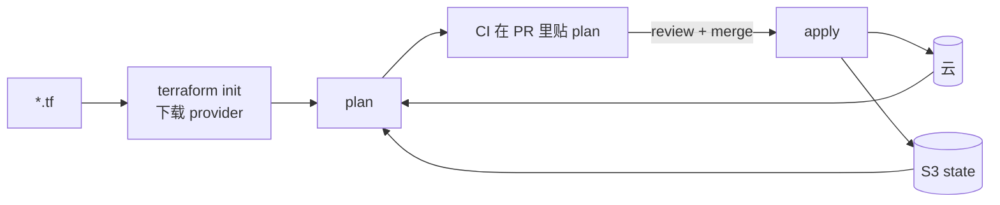

<KeyIdea>
**一句话**：Terraform 是 IaC 的事实标准，2024 年起协议改为 BSL（非 OSI 开源），社区 fork 出 **OpenTofu** 完全开源。**API 兼容**，迁移基本就是改命令名。
</KeyIdea>

## 是什么

```hcl
terraform {
  required_providers {
    aws = { source = "hashicorp/aws", version = "~> 5.0" }
  }
  backend "s3" {
    bucket = "tfstate-prod"
    key    = "infra/main.tfstate"
    region = "us-east-1"
    dynamodb_table = "tfstate-lock"
    encrypt = true
  }
}

module "vpc" {
  source = "terraform-aws-modules/vpc/aws"
  name   = "prod"
  cidr   = "10.0.0.0/16"
  azs    = ["us-east-1a", "us-east-1b"]
}

resource "aws_s3_bucket" "media" {
  bucket = "media-prod-${random_id.suffix.hex}"
  force_destroy = false
}
```

```bash
terraform init
terraform plan -out=tfplan
terraform apply tfplan
```

## 打个比方

<Analogy>
没 Terraform 之前 = 在云控制台里**手工点点点 + 截图记录**；  
有了之后 = **写一份 IKEA 说明书**，谁来都能照搭出**一模一样**的家具。
</Analogy>

## 关键概念

<Terms items={[
  { term: "Provider", en: "云适配器", def: "AWS / GCP / Azure / Cloudflare / GitHub —— 几乎所有云资源都有。" },
  { term: "Resource", en: "资源", def: "云端的一个对象。配置即源。" },
  { term: "Data Source", en: "数据源", def: "只读：去云上查一个已存在的资源属性。" },
  { term: "Module", en: "模块", def: "可复用资源组合，类似函数。" },
  { term: "Backend", en: "状态后端", def: "S3 / GCS / Terraform Cloud。**远端 + 锁**，多人协作必备。" },
  { term: "Workspace / 多环境", en: "Workspace", def: "同一份代码多状态，区分 dev/staging/prod。也可用目录结构隔离更清楚。" },
  { term: "Plan", en: "计划", def: "只算差量不执行；CI 把它贴 PR 评审用。" },
]} />

## 工作流



PR 流程是 IaC 安全的关键 —— **改 prod 必经审查**。

## 实操要点

- **远端 state + 锁**：S3 + DynamoDB / GCS / Terraform Cloud / Spacelift。**单人也用**，将来加人零成本。
- **模块化**：`modules/network/`、`modules/eks-cluster/` —— 复用 + 测试。
- **环境分目录**：`envs/prod/main.tf` 引用 modules + 覆盖变量。比 workspace 更直观。
- **机密走 secret backend**：tfvars 不进 git。或用 `vault_generic_secret` 数据源直接拉。
- **`prevent_destroy = true`** 给 prod DB / 关键 bucket 加锁，防 `destroy` 误伤。
- **drift 检测**：定时跑 plan，云上手改的内容会被发现。
- **OpenTofu 切换**：`opentofu init / plan / apply`，二进制 drop-in。重大新特性后续会 diverge。
- **不要把所有东西塞一个 root**：blast radius，多 root 分仓更安全。

## 易混点

<Compare
  leftTitle="Terraform / OpenTofu"
  rightTitle="Ansible"
  left={<>
    管**云对象**。<br />
    创建 / 更改 / 删除资源。
  </>}
  right={<>
    管**已有机器内部**配置。<br />
    包 / 文件 / 服务。
  </>}
/>

## 延伸阅读

- [基础设施即代码（IaC）](/ops/advanced/iac)
- [Ansible](/ops/ecosystem/ansible)
- [GitHub Actions](/ops/ecosystem/github-actions)
