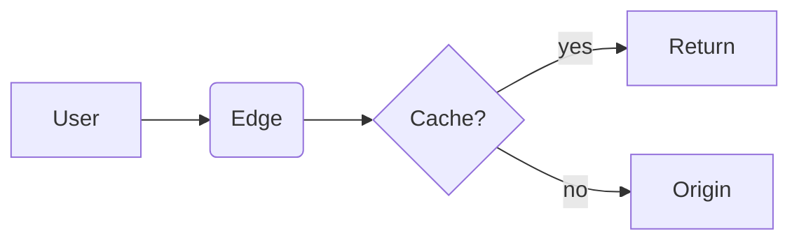

# Authoring Guide

This is the spec for adding content to ArcLibrary. Follow it and your
new article will:

- show up in the sidebar in the right chapter and order,
- be picked up by the build-time search index automatically,
- be navigable + highlightable by the AI assistant,
- have proper SEO metadata and a unique social-share OG image,
- and respect the site's visual conventions.

> 中文版 → [`AUTHORING_ZH.md`](./AUTHORING_ZH.md)

---

## TL;DR — what do I have to do?

> **Just drop your `.md` file under the right folder. That's it.**

You do **not** need to:

- register the file anywhere,
- regenerate the search index manually,
- write a route or a TypeScript type,
- update a sidebar config,
- touch a sitemap or OG image — they're all dynamic.

The site's three-tier taxonomy (**Domain → Level → Topic**) is driven
entirely by:

1. The `CATEGORIES` and `LEVELS` arrays in `src/lib/config.ts`.
2. The folder structure under `content/`.

The first time you run `pnpm dev` (or `pnpm build`) the `predev` /
`prebuild` hook runs `scripts/build-search-index.mjs`, which scans
`content/` and emits one shard per locale to `public/search-index/<lang>.json`.
The client fetches only the active locale's shard on first search-modal open.
Your new article is indexed before the dev server even starts.

The **only** time you need to touch code is when you add a brand-new
**domain** (e.g. "security") or a brand-new **level** (e.g. "advanced++")
— see [§ Adding a new domain or level](#adding-a-new-domain-or-level).

---

## File layout

```
content/
  <domain>/         # e.g. ai, network, ops — must match a CATEGORIES.slug
    <level>/        # e.g. beginner, advanced, ecosystem — must match a LEVELS.slug
      <slug>.md     # the article file; <slug> becomes the URL segment
```

Routes are derived directly:

```
content/ai/beginner/llm.md   →  /ai/beginner/llm
```

**Naming rules**:

- `<slug>` must be **lowercase, ASCII, hyphenated** (`local-inference.md`).
  No spaces, no Chinese, no underscores. The slug is part of the URL
  and must be SEO-safe.
- Keep slugs short and descriptive — they're never auto-generated from
  the title.
- Use `.md` for plain Markdown, `.mdx` if you need to embed React /
  custom components.
- One article per file. Don't try to nest folders deeper than `<slug>`.

---

## Frontmatter

Every article **must** start with a YAML frontmatter block. Missing
fields fall back to placeholder values (you'll see them in the UI),
so consider them required.

```yaml
---
title: "LLM (Large Language Model)"
description: "Generative AI's 'big head' — predicts the next token by likelihood."
icon: brain
order: 1
chapter: llm-basics
chapterTitle: "LLM Basics"
chapterOrder: 1
tags: [LLM, Foundations]
---
```

| Field           | Type        | Required | What it does                                                                        |
| --------------- | ----------- | -------- | ----------------------------------------------------------------------------------- |
| `title`         | string      | yes      | The H1 of the page, the link label in the sidebar, the `<title>` for SEO.           |
| `description`   | string      | yes      | One-sentence summary. Goes into `<meta name="description">`, OG / Twitter cards, search results, sidebar previews, and the OG image. **Keep it under ~140 chars.** |
| `icon`          | string      | yes      | A [lucide-react](https://lucide.dev) icon name. Shown in the sidebar / cards.        |
| `order`         | number      | yes      | Position **within the chapter** (lowest first).                                      |
| `chapter`       | string      | yes      | Slug grouping articles into a section. Same `chapter` = same section.                |
| `chapterTitle`  | string      | yes      | Display title for the chapter group.                                                 |
| `chapterOrder`  | number      | yes      | Position **of the chapter** in the level (lowest first).                             |
| `tags`          | string[]    | yes      | Free-form labels. Indexed by Fuse.js search and exposed under the title.             |

### Field rules

- `title` should be **specific and human-readable**. Avoid raw acronyms
  unless they're widely known — prefer `"LoRA (Low-Rank Adaptation)"` over
  bare `"LoRA"`.
- `description` should make sense **in isolation** (e.g. read in a
  search-result snippet without the title). Don't start it with "This
  article …".
- `chapter` slug should be lowercase + hyphenated (`getting-started`,
  not `Getting Started` or `getting_started`).
- `order` and `chapterOrder` are **integers**. Leave gaps (10, 20, 30 …)
  if you expect to insert articles between existing ones.
- `tags` should be 1–4 short labels. Don't over-tag.

---

## Body — Markdown

The body is GitHub-flavored Markdown with KaTeX math support and Shiki
syntax highlighting. The rules below capture conventions specific to
this codebase; everything else behaves like standard MDX.

### Headings

- **Don't** add a top-level `# H1` in the body — the page H1 comes from
  `title`. Start at `## H2`.
- `## H2` is rendered as a section divider with a hairline rule. Use it
  sparingly — one per major section.
- `### H3` is for sub-sections. Don't go deeper than `H4`.
- Headings get auto-generated anchor IDs (via `rehype-slug`) and
  hover-anchor links (via `rehype-autolink-headings`). Use them.

### Paragraphs and lists

- Keep paragraphs short (3–6 lines). Long paragraphs read poorly on
  wide screens.
- Use `-` for unordered lists, `1.` for ordered.
- Use **bold** for emphasis on terms, *italic* sparingly. Don't bold
  whole sentences.

### Links

- Internal links: `[Embeddings](/ai/beginner/embeddings)` — relative to
  the site root, no `.md` extension.
- External links open in a new tab automatically (handled by the MDX
  pipeline). No need to add `target="_blank"`.

### Code

Inline code: `` `pnpm install` ``. Block code:

````markdown
```python
def softmax(x):
    return np.exp(x) / np.sum(np.exp(x))
```
````

- Always specify a language; otherwise Shiki falls back to plain text
  and you lose highlighting.
- Code blocks get a copy button automatically.

### Math

```markdown
Inline: $\text{softmax}(x_i) = e^{x_i} / \sum_j e^{x_j}$

Block:

$$
\mathcal{L} = -\sum_t \log p_\theta(x_t \mid x_{<t})
$$
```

### Mermaid

````markdown

````

Mermaid renders client-side and is theme-aware (re-renders on dark/light
switch). Use it for flowcharts, sequence diagrams, ER diagrams, etc.

### Images

```markdown

```

- Drop static images under `public/images/` and reference them from
  `/images/...`.
- **Always** write meaningful `alt` text — required for accessibility
  and image SEO.
- Prefer SVG for diagrams, PNG for screenshots, both ≤ ~300 KB.
- Don't embed remote images (`https://i.imgur.com/...`) in articles —
  they break offline reading and bypass our CDN.

### Tables

Use GFM tables. Keep header rows aligned for readability:

```markdown
| Param | Default | Description       |
| ----- | ------- | ----------------- |
| `n`   | `8`     | Number of tokens  |
| `t`   | `0.7`   | Temperature       |
```

For dense key/value lists, prefer the `<KV>` MDX component (below) over
a 2-column table.

---

## MDX components

These are auto-imported when you write a `.mdx` file (or use them in
`.md` if MDX evaluation is on for that file). Don't `import` them
yourself.

### `<Callout>` — info / tip / warn / danger

```mdx
<Callout type="tip" title="Save tokens">
  Reuse a system prompt template instead of re-sending the same setup
  every turn.
</Callout>
```

| Prop    | Type                                  | Default | Notes                            |
| ------- | ------------------------------------- | ------- | -------------------------------- |
| `type`  | `"info" \| "tip" \| "warn" \| "danger"` | `"info"` | Picks the icon and label.        |
| `title` | string                                | —       | Optional, overrides the default. |

### `<KeyIdea>` — the "one-line takeaway"

Use **once per article**, near the top, to call out the single most
important sentence.

```mdx
<KeyIdea>
  An LLM is a model trained to predict the **next token** given the
  preceding ones — chained, that becomes language.
</KeyIdea>
```

### `<Analogy>` — plain-language comparison

```mdx
<Analogy>
  An embedding is a coordinate on a "meaning map": similar concepts
  cluster together.
</Analogy>
```

### `<Quote>` — pull quote

```mdx
<Quote source="Attention Is All You Need">
  Attention is all you need.
</Quote>
```

### `<Term>` and `<Terms>` — glossary helpers

```mdx
The <Term en="LLM">大语言模型</Term> predicts the next token …

<Terms
  items={[
    { term: "Token", en: "Token", def: "The atomic unit a model reads." },
    { term: "Embedding", en: "Embedding", def: "A vector representation of a token." },
  ]}
/>
```

### `<KV>` — key/value table

```mdx
<KV
  items={[
    { k: "temperature", v: "0.0–2.0, higher = more random" },
    { k: "top_p",       v: "0.0–1.0, nucleus sampling cutoff" },
  ]}
/>
```

### `<Compare>` — side-by-side comparison

```mdx
<Compare
  leftTitle="Synchronous"
  rightTitle="Streaming"
  left={<>Wait for the full response.</>}
  right={<>Receive tokens as they're generated.</>}
/>
```

### `<Steps>` / `<Step>` — numbered procedure

```mdx
<Steps>
  <Step title="Install">`pnpm install`</Step>
  <Step title="Configure">Add `.env.local` with your API key.</Step>
  <Step title="Run">`pnpm dev`</Step>
</Steps>
```

### `<Tag>` — inline pill

```mdx
<Tag>Foundations</Tag>
```

### `<Stat>` / `<Stats>` — numeric callouts

```mdx
<Stats>
  <Stat label="Params" value="7B" />
  <Stat label="Context" value="128K" />
  <Stat label="VRAM" value="~14GB" />
</Stats>
```

---

## Search & AI behavior

You don't have to do anything special — but knowing how it works helps
you write higher-signal frontmatter.

- **Search index**: built from `title`, `description`, `tags`, and the
  raw markdown body. Strong `title` + `description` + `tags` =
  significantly better ⌘K hits.
- **AI tool `search_docs`**: hits the same Fuse.js index. The model
  passes the user's query verbatim, so writing precise frontmatter
  pays off twice.
- **AI tool `highlight`**: receives a `query` string from the model
  (often a key phrase from the article). The frontend tries to find
  that phrase in the rendered article text and pulses it. **Tip**:
  if you have a "definition sentence", make sure the literal phrasing
  the user might ask about appears verbatim somewhere in the body —
  not paraphrased.

---

## SEO behavior

You also don't have to do anything for SEO — every article gets:

- a unique `<title>` from frontmatter,
- a unique `<meta name="description">`,
- a canonical URL,
- Open Graph + Twitter Card metadata,
- a dynamically generated 1200×630 OG image at
  `/api/og?title=…&description=…&kicker=Domain · Level · Chapter`,
- a `TechArticle` JSON-LD blob,
- and an entry in `/sitemap.xml`.

If you want to override the OG image with a static one for a particular
article, you can extend `generateMetadata` in
`src/app/[category]/[level]/[slug]/page.tsx` to read an `og` field from
frontmatter, but it's rarely needed — the dynamic one looks good and
stays consistent across the site.

---

## Adding a new domain or level

This is the **only** workflow that requires touching code.

### New domain (e.g. "security")

1. Open `src/lib/config.ts`.
2. Append an entry to `CATEGORIES`:

   ```ts
   {
     slug: "security",
     name: "安全",
     shortName: "安全",
     description: "应用安全 · 网络安全 · 数据安全",
     tagline: "Security",
     accent: "#ededed",
     icon: "shield",
   },
   ```

3. Create the folders:

   ```bash
   mkdir -p content/security/{beginner,advanced,ecosystem}
   ```

4. Drop your first `.md` in any of them.
5. (Optional) If you want the domain name localized, add an entry to
   `src/i18n/dict.ts`.

### New level (e.g. "expert")

Levels are global — adding one creates a new tab on **every** domain.

1. Append to `LEVELS` in `src/lib/config.ts`.
2. Create `content/<every-domain>/<new-level>/` folders as needed
   (an empty folder is fine — the level just won't show up for that
   domain until you add a file).
3. Done.

---

## Local checklist before opening a PR

```bash
pnpm dev          # see the article render, sidebar pickup, search hit
pnpm typecheck    # tsc --noEmit
pnpm lint         # next lint
pnpm build        # full prod build, validates index + OG route + metadata
```

When opening the PR, mention:

- which domain/level you added to,
- whether this is a brand-new chapter or extends an existing one,
- any code-level changes (taxonomy, components, etc.) — content-only
  PRs should not touch `src/`.

---

## Style cheat-sheet

- One `<KeyIdea>` per article.
- Max two `<Callout>` per page; never stack them back-to-back.
- Code blocks: always specify the language.
- Headings: start at `## H2`, never repeat the page title.
- Bold for terms, italics for emphasis. Avoid ALL CAPS.
- Tables for ≥ 3 columns or comparisons across rows; `<KV>` for 2-col
  key/value lists.
- Diagrams: prefer Mermaid over screenshots when describing flows.
- Math: use `$...$` and `$$...$$`, not Unicode hacks.
- Internal links use root-relative paths (`/ai/beginner/llm`), no `.md`.
- Don't paste your own prose into `description` — write it fresh.
- If you can replace a paragraph with a `<KV>` or `<Steps>`, do it.

If a rule isn't here and you're unsure, **copy the closest existing
article**. Consistency beats novelty.
