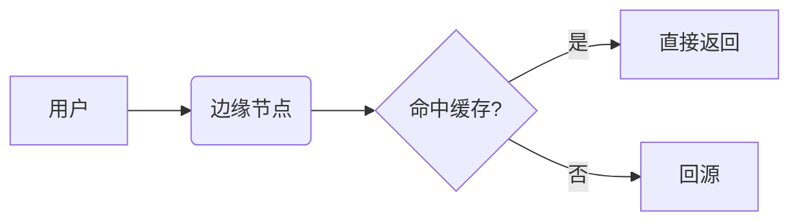

# 文档编写规范

ArcLibrary 的内容编写规约。照着写，新增的文档会自动：

- 出现在侧栏正确的章节、正确的位置；
- 被构建期搜索索引收录；
- 可被 AI 助手跳转 + 高亮；
- 拥有独立的 SEO metadata 和动态生成的社交分享头图；
- 视觉风格与全站保持一致。

> English version → [`AUTHORING.md`](./AUTHORING.md)

---

## TL;DR ——「我到底要做什么」

> **把 `.md` 文件丢进对应文件夹就行，其它不用管。**

你**不需要**：

- 在任何地方注册这个文件，
- 手动重建搜索索引，
- 写路由或者 TypeScript 类型，
- 改侧栏配置，
- 改 sitemap 或 OG 图 —— 全是动态的。

站点的三层分类（**领域 Domain → 层级 Level → 知识点 Topic**）只由两件事决定：

1. `src/lib/config.ts` 里的 `CATEGORIES` 和 `LEVELS` 数组。
2. `content/` 下的目录结构。

第一次跑 `pnpm dev`（或 `pnpm build`）时，`predev` / `prebuild` 钩子会自动跑
`scripts/build-search-index.mjs`，扫描 `content/` 后**按语言分片**输出到
`public/search-index/<lang>.json`，前端只在用户打开搜索框时按当前语言懒加载对应分片，
所以即便词条量翻倍也不会拖慢首次加载。你新加的文档在 dev server 启动前就已经被索引。

**只有**新增一个全新的「领域」（比如除了 AI / 网络 / 运维之外的「安全」、「设计」）
或者全新的「层级」（比如除了入门 / 进阶 / 生态之外的「实战」）时，才需要碰一行代码 ——
见下面的 [§ 新增领域或层级](#新增领域或层级)。

---

## 文件位置

```
content/
  <领域>/                # ai, network, ops 之类，必须等于 CATEGORIES.slug
    <层级>/              # beginner, advanced, ecosystem 之类，必须等于 LEVELS.slug
      <slug>.md          # 文档文件；<slug> 就是 URL 末段
```

路由直接由路径派生：

```
content/ai/beginner/llm.md   →  /ai/beginner/llm
```

**命名规则**：

- `<slug>` **必须是小写、ASCII、用连字符分隔**（`local-inference.md`），
  不能有空格、中文、下划线。slug 会变成 URL 一部分，必须 SEO 友好。
- slug 短而准确即可，不要从标题机械生成。
- 普通 Markdown 用 `.md`；要插入 React / 自定义组件的用 `.mdx`。
- 一篇文档一个文件，不要再嵌套子文件夹。

---

## Frontmatter（前置元数据）

每篇文档**必须**以一段 YAML frontmatter 开头。任何字段缺失都会用占位值兜底，
你会在 UI 上一眼看出来 —— 所以下面这些**全部当作必填**。

```yaml
---
title: "LLM（大语言模型）"
description: "生成式 AI 的「大脑」—— 通过概率预测下一个 token。"
icon: brain
order: 1
chapter: llm-basics
chapterTitle: "LLM 基础"
chapterOrder: 1
tags: [LLM, 基础]
---
```

| 字段           | 类型     | 必填 | 作用                                                                                       |
| -------------- | -------- | ---- | ------------------------------------------------------------------------------------------ |
| `title`        | string   | 是   | 页面 H1、侧栏标题、SEO `<title>`。                                                          |
| `description`  | string   | 是   | 一句话简介。会进入 `<meta name="description">`、OG / Twitter Card、搜索结果、侧栏摘要、OG 图。**不超过约 140 字。** |
| `icon`         | string   | 是   | [lucide-react](https://lucide.dev) 图标名，用于侧栏 / 卡片。                                 |
| `order`        | number   | 是   | 在**章节内**的排序（数字小的在前）。                                                         |
| `chapter`      | string   | 是   | 章节 slug，相同 `chapter` 视为同一章。                                                       |
| `chapterTitle` | string   | 是   | 章节展示标题。                                                                              |
| `chapterOrder` | number   | 是   | 章节在该层级中的顺序（数字小的在前）。                                                        |
| `tags`         | string[] | 是   | 自由标签，会被搜索索引收录，并在标题下方展示。                                                |

### 字段写作规则

- `title` 要**具体且可读**。除非是高知名度缩写，否则尽量带上中文 / 全称：
  写 `"LoRA（Low-Rank Adaptation）"` 而不是裸的 `"LoRA"`。
- `description` 必须**离开标题也能读懂**（想象它独立出现在搜索结果片段里）。
  不要以「这篇文档介绍了…」起头。
- `chapter` 必须是**小写 + 连字符**（`getting-started`，不是 `Getting Started` 或
  `getting_started`）。
- `order` 和 `chapterOrder` **必须是整数**，建议留空隙（10、20、30…）方便后期插入。
- `tags` 控制在 1–4 个，不要堆砌。

---

## 正文 —— Markdown

正文是 GitHub-Flavored Markdown，附带 KaTeX 公式和 Shiki 语法高亮。下面是
**本仓库特有的约定**，其它行为与标准 MDX 一致。

### 标题层级

- **不要**在正文里写顶层 `# H1`，页面 H1 来自 frontmatter 的 `title`。从 `## H2`
  开始。
- `## H2` 会渲染成带细线分隔的章节标题，**节制使用** —— 一个主章节一个。
- `### H3` 用于子节，最多到 `H4`。
- 所有标题会被 `rehype-slug` 自动加上锚点，`rehype-autolink-headings`
  自动生成 hover 链接。可以放心引用。

### 段落与列表

- 段落控制在 3–6 行，过长在宽屏上不好读。
- 无序列表用 `-`，有序列表用 `1.`。
- 关键术语用 **加粗**，*斜体* 节制使用，不要整句加粗。

### 链接

- 站内链接：`[Embeddings](/ai/beginner/embeddings)` —— **根相对路径**，
  不带 `.md` 扩展名。
- 站外链接由 MDX 管线自动 `target="_blank"`，无需手动处理。

### 代码

行内：`` `pnpm install` ``。代码块：

````markdown
```python
def softmax(x):
    return np.exp(x) / np.sum(np.exp(x))
```
````

- **必须指定语言**，否则 Shiki 退化为纯文本，没有高亮。
- 代码块自带复制按钮。

### 数学公式

```markdown
行内：$\text{softmax}(x_i) = e^{x_i} / \sum_j e^{x_j}$

块级：

$$
\mathcal{L} = -\sum_t \log p_\theta(x_t \mid x_{<t})
$$
```

### Mermaid 流程图

````markdown

````

Mermaid 在客户端渲染，主题感知（亮 / 暗切换会重渲）。流程图、时序图、ER
图都用它。

### 图片

```markdown

```

- 静态图放 `public/images/` 下，路径用 `/images/...`。
- **必须**写有意义的 `alt` —— 无障碍访问 + 图片 SEO 都靠它。
- 流程图优先 SVG，截图用 PNG，单张控制在 ~300 KB 以内。
- 不要在文档里直接引用外站图（`https://i.imgur.com/...`），会破坏离线阅读。

### 表格

GFM 表格，表头对齐保持可读：

```markdown
| 参数  | 默认值  | 说明              |
| ----- | ------ | ---------------- |
| `n`   | `8`    | token 数量       |
| `t`   | `0.7`  | 温度             |
```

仅 2 列的 key/value，优先用下面的 `<KV>` 组件，不要硬上表格。

---

## MDX 组件

写 `.mdx` 文件时下面这些组件**已经全局注入**，**直接用，不要 `import`**。

### `<Callout>` —— info / tip / warn / danger

```mdx
<Callout type="tip" title="省 token">
  复用 system prompt 模板，不要每轮都重发同样的设定。
</Callout>
```

| 属性    | 类型                                  | 默认    | 说明                          |
| ------- | ------------------------------------- | ------- | ---------------------------- |
| `type`  | `"info" \| "tip" \| "warn" \| "danger"` | `"info"` | 决定图标和默认标签。          |
| `title` | string                                | —       | 可选，覆盖默认标签。          |

### `<KeyIdea>` —— 一句话核心要点

**每篇文档最多一个**，放在开头附近，强调最关键的那句话。

```mdx
<KeyIdea>
  LLM 的本质是：给定前面所有 token，预测**下一个 token** —— 链式生成就是语言。
</KeyIdea>
```

### `<Analogy>` —— 通俗类比

```mdx
<Analogy>
  embedding 就是「意义坐标」：相似的概念在向量空间里聚成一团。
</Analogy>
```

### `<Quote>` —— 大引用

```mdx
<Quote source="Attention Is All You Need">
  Attention is all you need.
</Quote>
```

### `<Term>` 与 `<Terms>` —— 术语 / 术语表

```mdx
<Term en="LLM">大语言模型</Term> 通过预测下一个 token 来工作 ……

<Terms
  items={[
    { term: "Token", en: "Token", def: "模型读取的最小单位。" },
    { term: "Embedding", en: "Embedding", def: "token 的向量表示。" },
  ]}
/>
```

### `<KV>` —— key/value 列表

```mdx
<KV
  items={[
    { k: "temperature", v: "0.0–2.0，越大越随机" },
    { k: "top_p",       v: "0.0–1.0，nucleus sampling 的截断" },
  ]}
/>
```

### `<Compare>` —— 双栏对比

```mdx
<Compare
  leftTitle="同步"
  rightTitle="流式"
  left={<>等服务端把整段返回完。</>}
  right={<>边生成边接收 token。</>}
/>
```

### `<Steps>` / `<Step>` —— 编号步骤

```mdx
<Steps>
  <Step title="安装">`pnpm install`</Step>
  <Step title="配置">在 `.env.local` 写入你的 API Key。</Step>
  <Step title="启动">`pnpm dev`</Step>
</Steps>
```

### `<Tag>` —— 行内标签胶囊

```mdx
<Tag>基础</Tag>
```

### `<Stat>` / `<Stats>` —— 数字标注

```mdx
<Stats>
  <Stat label="参数量" value="7B" />
  <Stat label="上下文" value="128K" />
  <Stat label="显存" value="~14GB" />
</Stats>
```

---

## 搜索与 AI 行为

你不需要做任何额外操作，但了解一下背后逻辑能帮你写出更有用的 frontmatter。

- **搜索索引**：从 `title` / `description` / `tags` / 原始 markdown 正文构建。
  写好这三处 = ⌘K 命中率显著提升。
- **AI 工具 `search_docs`**：命中同一份 Fuse.js 索引。模型会把用户的提问原样
  传过去，所以 frontmatter 写得越精准，AI 找内容越快。
- **AI 工具 `highlight`**：模型会传一段 `query`（通常是文章里的一个关键短语），
  前端在渲染好的正文中找到原文并加脉冲高亮。**Tip**：如果有「定义句」，
  尽量让用户可能问到的字面表达**原样**出现在正文某处，不要全篇换说法。

---

## SEO 行为

SEO 也不需要你做任何事 —— 每篇文档都会自动有：

- 独立的 `<title>`（来自 frontmatter）；
- 独立的 `<meta name="description">`；
- 规范化 canonical URL；
- Open Graph + Twitter Card 元数据；
- 一张动态生成的 1200×630 OG 头图：
  `/api/og?title=…&description=…&kicker=领域 · 层级 · 章节`；
- `TechArticle` 结构化数据（JSON-LD）；
- 出现在 `/sitemap.xml`。

如果某篇文档想用静态 OG 图覆盖默认动态图，可以在
`src/app/[category]/[level]/[slug]/page.tsx` 的 `generateMetadata` 里读
frontmatter 的 `og` 字段 —— 但通常没必要，动态图风格统一更好维护。

---

## 新增领域或层级

**只有这一种情况需要碰代码。**

### 新增领域（比如「安全」）

1. 打开 `src/lib/config.ts`。
2. 在 `CATEGORIES` 末尾追加：

   ```ts
   {
     slug: "security",
     name: "安全",
     shortName: "安全",
     description: "应用安全 · 网络安全 · 数据安全",
     tagline: "Security",
     accent: "#ededed",
     icon: "shield",
   },
   ```

3. 创建对应文件夹：

   ```bash
   mkdir -p content/security/{beginner,advanced,ecosystem}
   ```

4. 在任一层级下放入第一篇 `.md`。
5. （可选）想本地化领域名，去 `src/i18n/dict.ts` 加翻译。

### 新增层级（比如「实战」）

层级是全局的 —— 加一个会在**所有**领域下都多出一个 tab。

1. 在 `src/lib/config.ts` 的 `LEVELS` 末尾追加。
2. 按需创建 `content/<领域>/<新层级>/` 文件夹（空文件夹也行，没文件那个领域
   就暂时不显示这个层级）。
3. 完成。

---

## 提交 PR 前的本地清单

```bash
pnpm dev          # 实际看一眼侧栏 / 搜索 / 渲染是否正常
pnpm typecheck    # tsc --noEmit
pnpm lint         # next lint
pnpm build        # 完整生产构建，校验索引 + OG 路由 + metadata
```

PR 描述里说清楚：

- 你写到了哪个领域 / 层级；
- 是新章节还是扩充已有章节；
- 有没有改代码（分类、组件等） —— 仅内容的 PR 不应该动 `src/`。

---

## 风格速查表

- 每篇文档最多一个 `<KeyIdea>`。
- `<Callout>` 一页最多两个，**不要**连续紧挨着放。
- 代码块**必须**指定语言。
- 标题从 `## H2` 起步，不要在正文重复页面标题。
- 加粗用于术语，斜体用于强调，不要全大写。
- ≥ 3 列或行间对比用表格；2 列 key/value 用 `<KV>`。
- 流程优先用 Mermaid，不要截图代替。
- 公式用 `$...$` / `$$...$$`，不要堆砌 Unicode。
- 站内链接用根相对路径（`/ai/beginner/llm`），不带 `.md`。
- `description` 单独写，不要直接复制段落里的句子。
- 段落能换成 `<KV>` 或 `<Steps>` 的，就换。

不确定怎么写时，**抄最接近的一篇现成文档**。一致性比新意重要。
